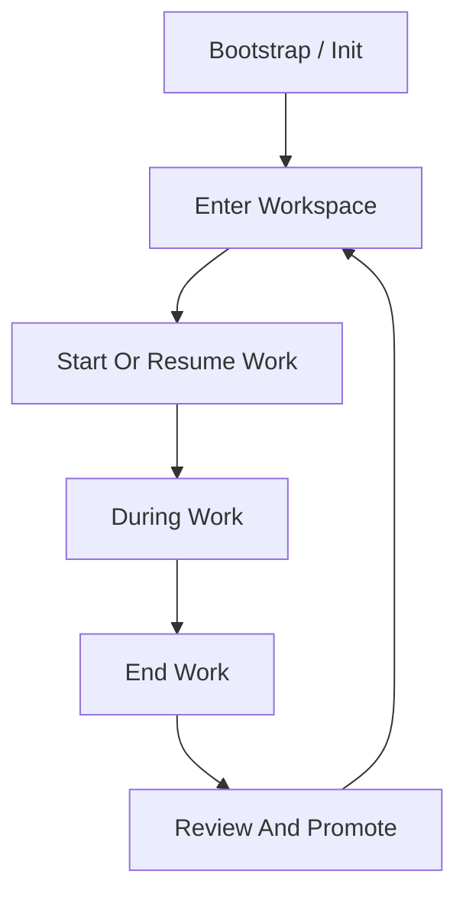
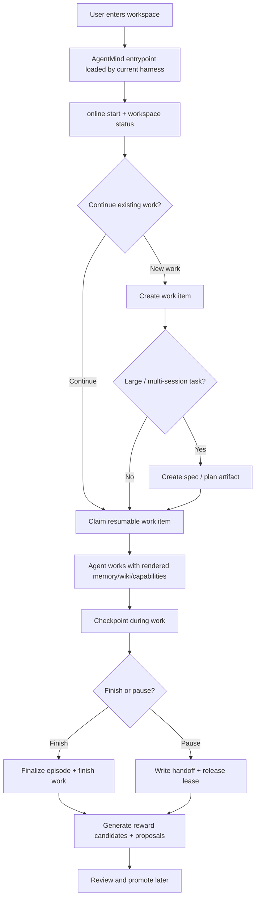
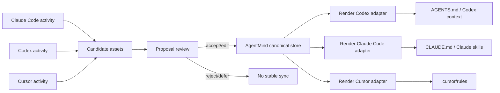
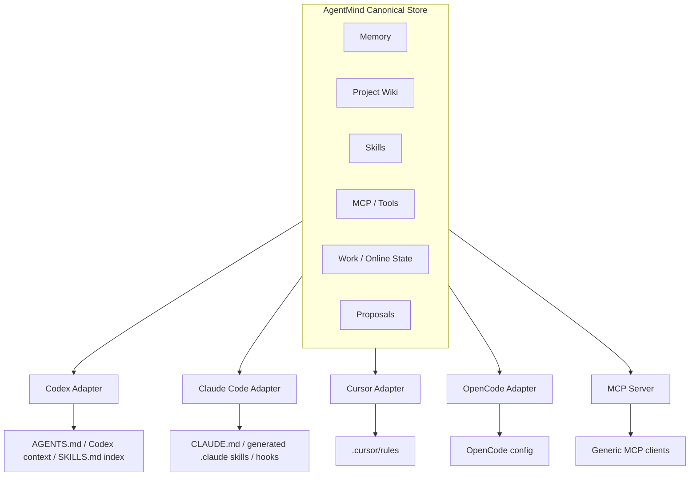
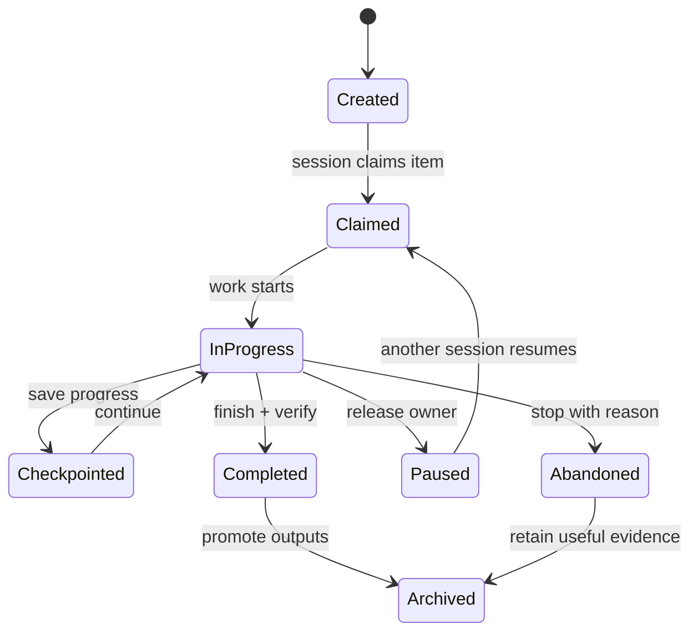
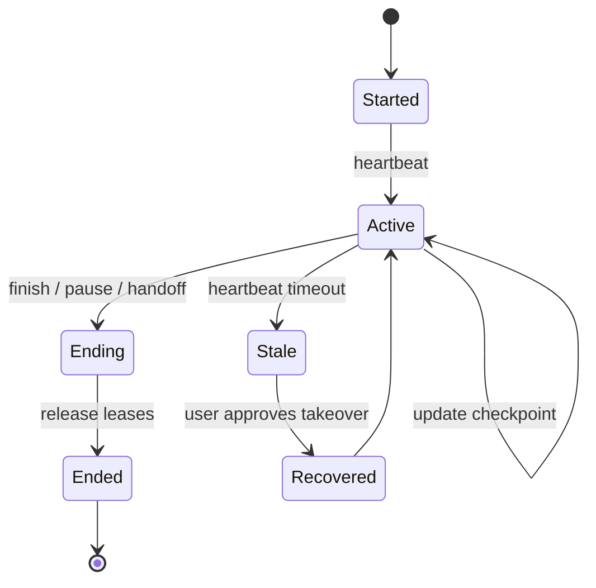

# Local Agent Context Layer PRD

## 1. Overview

Local coding agents such as Codex, Claude Code, Cursor, OpenCode, and similar tools are increasingly capable inside a single session, but their project knowledge, working preferences, skills, and tool configuration remain fragmented across agents and sessions.

This product is a local-first capability layer for coding agents. It allows a project workspace to accumulate memory, wiki knowledge, executable skills, MCP/tool configuration, and reward signals over time, then expose those assets consistently across different local agent harnesses.

The product is not another coding agent. It is the project intelligence layer underneath local agents.

## 2. Product Thesis

A local agent should become more effective the longer it works on the same project.

That improvement should not be trapped inside one agent's private memory or prompt format. It should live in the workspace as durable, inspectable, evolvable project assets that can be reused by Codex, Claude Code, Cursor, OpenCode, and future agents.

The core product loop is:

```text
agent work -> episode record -> reward signal -> reflection -> update proposal -> validation/review -> evolved context assets -> better future agent work
```

## 3. Target Users

Primary users:

- Developers who use multiple local coding agents on the same project.
- Developers working on long-running codebases where repeated context loss is expensive.
- AI-native engineers who want project knowledge, rules, skills, and tools to compound over time.

Secondary users:

- Small teams that want shared agent memory for a repo.
- Agent framework builders who need a local memory/skill substrate.
- Power users who want transparent, file-backed context instead of opaque SaaS memory.

## 4. Problem Statement

Local agents currently suffer from four related issues:

1. **Session amnesia**: Each new session often starts without enough project history.
2. **Agent silos**: Codex, Claude Code, Cursor, and other agents each use different memory, rules, skills, and config surfaces.
3. **Unstructured learning**: Useful lessons from completed work are rarely converted into durable memory, wiki knowledge, or skills.
4. **Stale context risk**: Project facts change, but agent-facing memory and instructions often remain outdated.

The product should make project context and agent capability cumulative, portable, and maintainable across harnesses.

## 5. Goals

- Provide a shared local context layer for multiple coding agents.
- Maintain public memory, project wiki, skills, MCP/tool configuration, and reward history as first-class assets.
- Record agent work as structured episodes.
- Use human feedback and execution outcomes as reward signals.
- Generate staged update proposals for memory, wiki, skills, and tools.
- Support human review and validation before risky updates become durable.
- Keep assets readable, inspectable, and portable through Markdown and structured local files.

## 6. Non-Goals

- Build a replacement coding agent.
- Fine-tune model weights.
- Depend on a cloud service for the core local workflow.
- Automatically rewrite important project knowledge without review or evidence.
- Solve team-scale governance in the first version.

## 7. Product Principles

### 7.1 Slow Down On High-Impact Settings

High-impact AgentMind settings that shape long-term behavior and knowledge structure must be discussed and researched carefully. An agent should not decide them casually in a single response.

These settings include, but are not limited to:

- Project goals, long-term objectives, and stage objectives.
- Project wiki schema: taxonomy, page types, frontmatter, naming rules, source classes, index/log rules.
- Project-specific maintenance skill: how to ingest/query/lint/promote, and what can become fixed knowledge.
- Capability/skill promotion policy: what behavior deserves reusable skill status versus temporary runbook or proposal status.
- High-impact memory and team/user operating preferences.

Principle: **the more accurate these settings are, the less pollution, rework, and bad generalization future agents create.** Before creating or modifying these settings, the agent should follow a discovery workflow:

1. Ask the user whether an existing schema, objective, taxonomy, team convention, or reference project already exists.
2. If not, inspect the workspace README, docs, source layout, past conversations, existing wiki/skills/tools, and open work.
3. Perform necessary external research for the project's business/domain, including comparable wiki/schema/skill organization patterns.
4. Propose 2-3 candidate designs, including fit, benefits, tradeoffs, risks, and migration impact.
5. Discuss with the user over multiple turns and record decisions plus unresolved questions.
6. Write stable schema, objectives, maintenance skills, or high-impact memory only after user confirmation or when configuration explicitly allows it.

AgentMind should not depend on Codex/Claude internal goal or plan mechanisms as product infrastructure. Cross-harness goals, plans, schema discovery state, and user decisions should be durable local files, such as work items, extraction packets, schema candidates, research notes, and decision logs.

## 8. Core Concepts

### 8.1 Context Assets

The product manages several evolving asset types.

| Asset | Purpose | Examples |
|---|---|---|
| Public Memory | User/workspace preferences and operating style | "Discuss before editing when intent is ambiguous", "Prefer rg", "Avoid new dependencies unless justified" |
| Project Knowledge System | Project-specific wiki content, schema, and maintenance skill | Architecture, domain concepts, decisions, workflows, gotchas, source-linked facts, project wiki operating rules |
| Skills | Executable agent workflows | Add API endpoint, fix auth test, create migration, release staging |
| MCP/Tools | Tool and integration capability | MCP servers, CLI commands, project-specific scripts, tool usage notes |
| Episodes | Structured history of agent work | Goal, context used, actions, diff, commands, tests, final response, next user feedback |
| Online Work State | Live sessions, work ownership, checkpoints, and handoffs | Active Codex session, stale Claude Code session, claimed work item, pause handoff |
| Rewards | Signals about success/failure/usefulness | User correction, tests passing, user acceptance, tool failure, rollback |
| Proposals | Candidate updates to assets | Patch memory, update wiki, modify skill, deprecate stale rule |

### 8.2 Public Memory

Public memory captures stable preferences and operating conventions that should influence agents across sessions and possibly across projects.

Examples:

- User prefers discussion before implementation during product ideation.
- User prefers concise, pragmatic engineering communication.
- Agent should read the existing codebase before proposing architecture.
- Avoid destructive commands unless explicitly approved.

Public memory is high-impact because it affects many future runs. Updates should usually require explicit confirmation or repeated evidence.

### 8.3 Project Knowledge System

The project knowledge system is more than a wiki. It is the workspace's evolving business-aware knowledge operating layer.

This layer follows the LLM Wiki pattern described by Karpathy: raw sources are not enough, because pure retrieval makes each agent re-derive the same synthesis at query time. AgentMind should compile durable project understanding into a persistent wiki that agents can reuse. In this sense, the wiki is the project's **compiled fixed knowledge layer**: not immutable forever, but stable, source-linked, and maintained through explicit updates rather than regenerated from scratch on every query.

The model has three layers:

1. **Raw sources**: source files, docs, issues, PRs, transcripts, episodes, rewards, command output, and imported references. These are source-of-truth inputs and should be read-only or append-only from AgentMind's perspective.
2. **Compiled wiki**: LLM/worker-maintained Markdown pages that summarize, cross-link, contradict, update, and synthesize raw sources into project knowledge.
3. **Wiki schema and maintenance skill**: the conventions and instructions that tell agents how to ingest sources, answer queries, lint the wiki, update pages, maintain links, and preserve citations.

It has three parts:

1. **Knowledge content**: the wiki pages themselves.
2. **Knowledge schema**: the project-specific taxonomy, page types, frontmatter, naming rules, and source handling rules.
3. **Knowledge maintenance skill**: the agent instructions for how to ingest, query, lint, update, and preserve the wiki.

The `fab-wiki` skill from the semiconductor planning workspace is the target pattern: it did not start as a generic wiki. It evolved through collaboration into a business-specific operating skill with source classes (`ours`, `competitor`, `partner`, `reference`), domain page types (`clients`, `cases`, `entities`, `concepts`, `synthesis`), strategic focus pages, and project-specific ingest/query/lint rules.

The product should help each project grow its own equivalent of `fab-wiki` over time.

Project wiki content should include:

- Project overview.
- Architecture and module boundaries.
- Domain model and business concepts.
- Important design decisions and rationale.
- Workflows, runbooks, and testing procedures.
- Gotchas and known failure modes.
- Recently changed assumptions.

Wiki entries should be source-linked when possible:

```yaml
title: Auth session lifecycle
type: architecture
sources:
  files:
    - packages/api/src/auth/session.ts
  commits:
    - abc123
confidence: verified
status: active
last_updated: 2026-06-20
```

The schema and maintenance skill should evolve from episodes and reward signals. For example, if repeated work shows that a project needs `clients/` and `cases/` pages rather than generic `entities/`, the system should propose a schema update and a corresponding update to the wiki-maintenance skill.

The fixed knowledge layer should support four wiki operations:

- **Ingest**: read a raw source or episode, extract durable facts, update relevant wiki pages, update `index.md`, and append to `log.md`.
- **Query**: answer from the compiled wiki first, with citations back to sources; high-value answers can be promoted back into the wiki.
- **Lint**: detect contradictions, stale claims, orphan pages, missing links, missing source citations, and concepts that deserve their own pages.
- **Promote**: turn repeated answers, successful workflows, or reviewed proposal patches into stable wiki pages or wiki schema updates.

This means the wiki is not a passive documentation folder. It is a maintained knowledge codebase: raw sources are the inputs, wiki pages are compiled artifacts, and schema/maintenance skills are the build rules.

#### Schema And Objective Discovery

Project schema and project objectives are high-impact AgentMind assets. They must follow the principle: ask the user first, inspect the workspace, research the domain, propose options, then confirm.

The first version should support a schema discovery packet instead of letting an agent directly invent the final wiki structure. Suggested intermediate files:

```text
.agent-context/extractions/<id>/PACKET.md
.agent-context/extractions/<id>/PLAN.md
.agent-context/extractions/<id>/schema-candidates.md
.agent-context/extractions/<id>/research-notes.md
.agent-context/extractions/<id>/user-decisions.md
```

The `agentmind-extraction` skill should define the schema discovery method:

- Ask whether the user already has a schema/objective/reference project.
- Read project sources, history, episodes, existing wiki, and existing skills.
- Perform network research when useful to find comparable project wikis, docs, skills, runbooks, and taxonomies.
- Present candidate schemas instead of finalizing immediately.
- Record user choices, modifications, unresolved questions, and future migration risk.

The schema artifact may start as a proposal; after user confirmation it can be written to `.agent-context/wiki/schema.md` and reflected into the wiki maintenance skill.

### 8.4 Skills, MCP, And Tools

Skills encode repeatable project workflows. They should be portable across agents where possible, with adapter-specific packaging only at the edge.

AgentMind should distinguish **skill content** from **harness discovery mechanics**:

- Skill content is a cross-harness capability: instructions, triggers, workflow steps, validation, failure handling, and safety boundaries.
- Harness discovery is adapter-specific: Claude Code may discover `.claude/skills/*/SKILL.md`; Codex may need an `AGENTS.md` instruction and a generated skill index; Cursor may need `.cursor/rules`.

Therefore, the canonical skill source should live in AgentMind first:

```text
.agent-context/skills/<skill-id>/SKILL.md
```

Adapters may render harness-native views from that canonical skill:

```text
.agent-context/skills/wiki-note/SKILL.md       # canonical source
.claude/skills/wiki-note/SKILL.md              # Claude Code generated view
.agent-context/adapters/codex/SKILLS.md        # Codex generated skill index
```

Claude Code can use skills outside `.claude/skills` when instructed to read them, but `.claude/skills` gives it a stronger native discovery surface. Codex can use the same `SKILL.md` content when `AGENTS.md` or a Codex skill index points it to the canonical skill file.

Examples:

- How to add a database migration in this repo.
- How to update an API contract and run the right tests.
- How to debug login/session failures.
- Which MCP server or CLI tool should be used for a given task.

Skills should evolve from repeated successful episodes, user feedback, failures, and validation results.

### 7.5 Episode

An episode is the unit of work and the main training signal container.

An episode should capture:

- User goal.
- Agent used.
- Context assets retrieved or injected.
- Skills/tools invoked.
- Files read or modified.
- Commands run and results.
- Verification results.
- Final assistant response.
- Next user message, if it contains feedback on the previous episode.
- Outcome label and reward events.

Example schema:

```json
{
  "id": "episode_20260620_001",
  "workspace": "/path/to/project",
  "agent": "codex",
  "goal": "Add contract test for auth endpoint",
  "assets_used": [
    "wiki:api-testing-workflow",
    "skill:add-api-endpoint"
  ],
  "actions": {
    "files_read": [],
    "files_modified": [],
    "commands": []
  },
  "verification": {
    "tests": "passed",
    "lint": "not_run"
  },
  "user_feedback": null,
  "outcome": "unknown"
}
```

## 8. Reward Model

Reward should not be hard-bound to one asset type. A human feedback event may update a skill, wiki page, tool rule, or public memory. An execution result may update a skill, wiki workflow, or tool reliability score.

The product should model rewards as events, then attribute them to relevant assets.

```text
reward event -> attribution -> update proposal -> gated apply
```

### 8.1 Reward Sources

| Source | Description | Examples |
|---|---|---|
| Human Feedback | User response after an agent output or action | "No, I meant discuss first", "This is correct", "Do not use this approach" |
| Verification Result | Agent-observed execution result | Tests passed, build failed, lint failed, app started, screenshot check passed |
| Codebase Acceptance | Whether work survives in the repo | Commit includes change, PR merged, user does not revert, CI passes later |
| Reuse Signal | Whether context assets helped future work | Retrieved, cited, acted on, followed by successful outcome |
| Contradiction/Staleness | Evidence that old knowledge is wrong or outdated | User correction, deleted module, new docs supersede old flow |
| Cost/Efficiency | Resource and workflow efficiency | Token use, turns, failed retries, command count, time-to-success |
| Safety/Risk | Negative signals about unsafe behavior | Unrelated file edits, secret exposure, destructive command, broken environment |

### 8.2 Unified Reward Event

```json
{
  "id": "reward_20260620_001",
  "source": "human",
  "polarity": "negative",
  "confidence": 0.9,
  "target_episode": "episode_20260620_001",
  "evidence": [
    "User said: I wanted discussion, not implementation."
  ],
  "suspected_causes": [
    "public-memory:interaction-style missing discussion preference",
    "skill:default-coding-flow lacks intent check"
  ]
}
```

### 8.3 Reward Attribution

Attribution determines what should change.

Possible attribution targets:

- Public memory: user preference or operating style.
- Project wiki: fact, workflow, architecture, or gotcha.
- Skill: steps, preconditions, validation, failure handling.
- MCP/tool config: reliability, selection rules, parameters.
- Agent adapter: how an asset is exposed to a specific agent.

Attribution should produce a proposal, not directly mutate stable assets.

## 9. Evolution Mechanism

The evolution loop has five stages.

### 9.1 Observe

Record an episode from agent work.

Inputs:

- User messages.
- Agent responses.
- Files read/modified.
- Diffs.
- Commands and outputs.
- Retrieved memory/wiki/skills/tools.

### 9.2 Reflect

At the start of a new user turn, inspect whether the user is reacting to the previous episode. Also inspect verification outcomes from the prior episode.

Outputs:

- Reward events.
- Outcome label.
- Candidate attribution.

### 9.3 Propose

Generate one or more update proposals.

Proposal types:

- Create memory.
- Update public memory.
- Add/update wiki entry.
- Add/update wiki schema or page taxonomy.
- Patch the project wiki maintenance skill.
- Mark wiki entry stale or superseded.
- Patch skill steps.
- Add skill validation step.
- Update MCP/tool selection rule.
- Deprecate unreliable tool usage.

Example:

```yaml
id: proposal_20260620_001
asset: skills/add-api-endpoint/SKILL.md
operation: replace
reason: User correction indicates endpoint changes require contract test updates.
evidence:
  - reward_20260620_001
  - episode_20260620_001
risk: medium
status: pending_review
```

### 9.4 Validate

Validation depends on proposal type.

Examples:

- Wiki fact update: check source files, commit hash, or user-provided evidence.
- Skill update: replay a similar task, run tests, or require user approval.
- Tool update: run health check, verify command availability, inspect failure rate.
- Public memory update: require explicit user confirmation unless repeated evidence exists.

### 9.5 Apply

Only apply updates after passing policy gates.

Suggested default policy:

| Update | Default Apply Policy |
|---|---|
| Transient episode summary | Automatic |
| Low-risk handoff update | Automatic |
| New candidate memory | Automatic to pending/candidate area |
| Public memory change | User confirmation |
| Project wiki fact change | Source evidence or user confirmation |
| Project wiki schema change | User confirmation plus migration preview |
| Project wiki maintenance skill change | User confirmation or repeated reward evidence |
| Skill behavior change | Validation or user confirmation |
| MCP/tool config change | Explicit confirmation |

### 9.6 Lifecycle Orchestration

AgentMind should define when each system action happens during real project work. Without this boundary, import, render, record, reflect, promote, and sync become ad hoc operations that users must remember manually.

The product lifecycle has six stages:



The same lifecycle should feel like a guided product flow, not a manual CLI checklist:



| Stage | Trigger | AgentMind Actions | Stable Asset Mutation |
|---|---|---|---|
| Bootstrap / Init | `agentmind init`, adapter setup, explicit import | Create canonical store, scan existing harness files, import candidate memory/skills/rules, create proposals, write managed entrypoints | Only creates missing files and managed blocks |
| Enter Workspace | Agent opens project or user says start | Register session, read active sessions/work queue/stale work/pending proposals, render workspace status for current harness | No stable wiki/skill mutation |
| Start Or Resume Work | User chooses existing work or creates new work | Create or claim work item, bind episode, optionally create spec, select relevant assets, render task-specific context | Work/session state only |
| During Work | Agent reads/writes files, runs commands, adds references, uses skills | Checkpoint, record episode events, capture references, record skill/tool use and verification, store observations | Candidate observations only by default |
| End Work | User says handoff/finish/stop, or task completes | Finalize episode, finish/pause work, release lease, write handoff, create reward candidates and proposals | Handoff/work/episode records; no cross-harness sync |
| Review And Promote | User reviews proposals or scheduled curation runs | Accept/reject/edit proposals, update canonical assets, render adapters | Yes, after gates pass |

Action timing rules:

1. **Import** happens at bootstrap or explicit import, not randomly during work.
2. **Render** happens when entering a workspace, starting/resuming work, or after accepted promotion.
3. **Record** happens continuously during work and at work end.
4. **Reflect** happens at work end and when a new user turn provides feedback on the previous episode.
5. **Promote** happens only through proposals and policy gates.
6. **Cross-harness sync** happens only after canonical assets are updated, then rendered into each harness adapter.

The key synchronization rule is:



AgentMind should not directly copy one harness's private memory or skills into another harness. It should lift useful behavior into canonical cross-harness assets, then render harness-specific views.

## 10. Worker Model

A worker is a background execution unit that processes deferred context-evolution tasks outside the main user conversation.

Workers do not need to be agents. They can be deterministic programs, LLM jobs, or subagents.

### 10.1 Worker Types

| Worker | Responsibility | Implementation |
|---|---|---|
| Recorder | Write episode records | Deterministic runtime |
| Reflector | Detect reward and attribution | LLM job or subagent |
| Curator | Merge, deduplicate, stale-check assets | Deterministic + LLM assisted |
| Validator | Run checks against proposals | Deterministic commands + optional agent |
| Adapter | Export assets to Codex/Claude/Cursor/OpenCode | Deterministic templates |

### 10.2 Subagent Usage

Subagents are useful when reflection requires heavy context reading or complex attribution. They should not directly mutate stable assets.

Recommended pattern:

```text
main agent -> records episode and continues user work
reflection worker/subagent -> analyzes episode asynchronously
worker -> creates pending proposals
user/policy gate -> applies accepted proposals
```

Subagents are an implementation option, not the product primitive. The product primitive is the reflection job and proposal queue.

## 11. Agent Integration

The product should expose the same canonical assets to multiple agents through adapters.



### 11.1 Canonical Store

Suggested local layout:

```text
.agent-context/
  sources/
    README.md
    external/
    episodes/
  memory/
    public.md
    workspace.md
  wiki/
    schema.md
    overview.md
    architecture.md
    domain.md
    workflows.md
    gotchas.md
    decisions.md
  skills/
    wiki-maintainer/
      SKILL.md
    add-api-endpoint/
      SKILL.md
    fix-auth-test/
      SKILL.md
  tools/
    mcp.json
    commands.yaml
  episodes/
    episode_20260620_001.json
  rewards/
    reward_20260620_001.json
  proposals/
    pending/
    accepted/
    rejected/
  adapters/
    codex/
    claude-code/
    cursor/
    opencode/
```

### 11.2 Adapter Outputs

| Agent | Adapter Output |
|---|---|
| Codex | `AGENTS.md`, `.agent-context/adapters/codex/SKILLS.md`, MCP config |
| Claude Code | `CLAUDE.md`, generated `.claude/skills/<skill-id>/SKILL.md`, hooks, MCP config |
| Cursor | `.cursor/rules`, MCP config |
| OpenCode | plugin/config/instructions |
| Generic MCP client | MCP server exposing memory/wiki/skill/tool APIs |

The canonical asset should be edited once. Agent-specific files should be generated or synchronized from it.

### 11.3 Cross-Harness Skill Rendering

AgentMind should treat `.agent-context/skills/` as the source of truth for project skills. Adapter outputs are views.

Rendering rules:

- Canonical skill edits happen in `.agent-context/skills/<skill-id>/SKILL.md` through proposals or explicit user action.
- Claude Code adapter may render a generated copy into `.claude/skills/<skill-id>/SKILL.md` for native discovery.
- Codex adapter should render a skill index, such as `.agent-context/adapters/codex/SKILLS.md`, and reference it from `AGENTS.md`.
- Adapter views should be marked generated and should not become the canonical source.
- Imported Claude Code skills can be promoted into canonical AgentMind skills, then rendered back to Claude Code and exposed to Codex.

This allows a skill originally written for Claude Code to become a cross-harness capability without assuming Codex has the same native skill directory or hook mechanism.

### 11.4 Skill Import, Promote, And Render Timing

Cross-harness skill migration should happen at explicit lifecycle points. AgentMind should not copy a Claude Code skill into Codex or canonical storage opportunistically during unrelated work.

| Timing | Input | Action | Output |
|---|---|---|---|
| Setup existing repo | Existing `.claude/skills/*`, `AGENTS.md`, `.cursor/rules`, local skill folders | Discover candidate skills and record provenance | Candidate capabilities + proposals |
| Explicit import | User runs `agentmind import skill <path>` | Copy or normalize the source into AgentMind candidate storage | Candidate canonical skill + review proposal |
| Review / promote | User accepts proposal | Promote candidate into canonical `.agent-context/skills/<skill-id>/SKILL.md` | Active canonical skill |
| Render adapters | `connect`, `render`, or accepted promotion | Generate harness views from canonical skill | `.claude/skills/*`, Codex `SKILLS.md`, Cursor rules |
| Work end / reflection | Episode shows a new or changed workflow | Generate skill patch proposal | Pending skill update |

Hard rules:

- Discovery is not promotion.
- Import is not activation.
- Promotion updates the canonical skill source.
- Render creates adapter views only.
- Adapter views are generated outputs, not the source of truth.

Canonical flow:

```text
.claude/skills/foo/SKILL.md
  -> discovered/imported candidate
  -> proposal
  -> accepted promotion
  -> .agent-context/skills/foo/SKILL.md
  -> rendered Claude view + Codex skill index
```

## 12. Capability Registry & Import Layer

The product should not rely only on self-generating skills and tools. Many useful skills, MCP servers, prompts, rules, and CLI tools already exist on the internet or on the user's machine. The product should be able to discover, import, evaluate, adapt, and manage these external capabilities.

The capability layer turns external skills/tools into project-aware assets.

```text
external skills / MCP servers / tools / prompt packs
  -> capability importer
  -> candidate registry
  -> project fit and risk evaluation
  -> adapter or wrapper
  -> active project capability
  -> episode/reward based promotion, adaptation, or deprecation
```

### 12.1 Capability Sources

| Source | Examples | Handling |
|---|---|---|
| GitHub repositories | Skill packs, MCP servers, agent rules | Scan manifests, README files, `SKILL.md`, config files |
| MCP registries | Official/community MCP servers | Read tool schemas, permissions, dependencies |
| Codex skills | `SKILL.md` assets | Import directly or convert to canonical skill format |
| Claude Code skills/plugins | `.claude/skills`, plugin assets | Convert to canonical skill or adapter-specific package |
| Cursor rules | `.cursor/rules/*.mdc` | Convert to rules, memory candidates, or workflow skills |
| Prompt packs | `AGENTS.md`, `CLAUDE.md`, rules files | Split into rules, workflows, and skill candidates |
| CLI tools | npm/pip/cargo/brew packages, repo scripts | Register as tool capabilities with command metadata |
| Local machine config | Existing MCP config, local skills, shell scripts | Discover and index as local capability candidates |

### 12.2 Capability Metadata

Each imported capability should be tracked with metadata before activation.

```yaml
id: mcp.github
type: mcp_server
source:
  kind: github
  url: https://github.com/modelcontextprotocol/servers/tree/main/src/github
version: 1.2.0
description: GitHub repository, issue, and PR operations.
permissions:
  network: true
  filesystem: false
  secrets:
    - GITHUB_TOKEN
risk: medium
status: candidate
project_fit:
  score: 0.72
  reasons:
    - Project uses GitHub issues and pull requests.
    - Recent episodes needed PR context.
adapters:
  codex: available
  claude-code: available
```

### 12.3 Capability Lifecycle

Capabilities should move through an explicit lifecycle:

```text
discovered -> candidate -> installed -> project-adapted -> active -> promoted -> deprecated
```

- `discovered`: Found but not analyzed.
- `candidate`: Potentially useful; waiting for evaluation or user review.
- `installed`: Downloaded or configured, but not necessarily active.
- `project-adapted`: Grounded in this repo's commands, wiki, conventions, and prior episodes.
- `active`: Available to agents in the workspace.
- `promoted`: Repeatedly useful and recommended by default.
- `deprecated`: Failed, obsolete, risky, or no longer relevant.

### 12.4 Project Fit Evaluation

The system should recommend external capabilities based on several signals:

- Static repo match: language, framework, package manager, config files, infrastructure files.
- Episode demand: repeated tasks involving PR review, browser testing, database schema lookup, Terraform, release notes, etc.
- User behavior: repeated manual requests that map to an available skill or MCP server.
- Outcome data: capability success rate, failure rate, user acceptance, and time saved.
- Risk data: secrets, network access, filesystem access, destructive actions, deployment or billing access.

### 12.5 Project Adaptation

External capabilities are usually generic. The product should ground them in project-specific context before promotion.

For example, a generic `fix-failing-tests` skill can become a project-adapted skill that includes:

- This repo's test commands.
- Which package to test first.
- Known flaky tests.
- Snapshot update policy.
- CI/local differences.
- User preferences about verification.

This is external skill grounding, not pure skill generation from scratch.

### 12.6 Safety Model

External tools and MCP servers can be risky. The product should never silently activate high-risk capabilities.

| Risk | Examples | Default Policy |
|---|---|---|
| Low | Instruction-only Markdown skill | Import as candidate automatically |
| Medium | Local CLI, read-only MCP server | Require user confirmation to activate |
| High | Network, write access, secrets, GitHub mutations | Explicit permission review |
| Critical | Shell execution, deletion, deployment, payments | Strong confirmation; never auto-enable |

Safety requirements:

- Show permission summary before activation.
- Pin source and version.
- Keep allowlist/blocklist support.
- Track tool calls and failures.
- Isolate secrets from generated skills/wiki.
- Allow deactivation and rollback.

### 12.7 Capability Discovery Workflow

Example user flow:

```text
memory-helper discover capabilities
```

The product returns ranked candidates:

```text
1. GitHub MCP
   Why: repo uses GitHub; recent episodes mention PR review.
   Risk: medium; requires GITHUB_TOKEN.
   Action: install / ignore / later

2. Playwright MCP
   Why: project has playwright.config.ts.
   Risk: medium; browser automation.
   Action: install / ignore / later

3. fix-failing-tests skill
   Why: repeated test failures in episodes.
   Risk: low; instruction-only.
   Action: import / adapt / ignore
```

Imported capabilities still enter the episode/reward/proposal loop. Successful use can promote or project-adapt a capability; repeated failure can patch, disable, or deprecate it.

## 13. Project Work Queue

AgentMind should maintain project execution state as a first-class context asset. This is not just a generic TODO list. It is a structured work queue that connects open questions, active work, completed work, episodes, rewards, proposals, wiki pages, references, and skills.

The work queue answers:

- What is unresolved?
- What is actively being worked on?
- What was completed?
- Which episodes and rewards belong to each item?
- Which completed items should be promoted into fixed knowledge or skills?

### 13.1 Work States

| State | Purpose | Examples |
|---|---|---|
| TODO / Backlog | Known future work, open questions, hypotheses, references to ingest | Define fixed knowledge promotion policy; decide wiki lint split |
| Doing | Active tasks, current episode, blockers, in-review proposals | Implement Codex adapter; review imported skill adaptation |
| Done | Completed tasks with linked outcomes | Initialized project store; accepted wiki schema update |

### 13.2 Suggested Store

```text
.agent-context/work/
  index.md
  todo.md
  doing.md
  done.md
  items.jsonl
```

Markdown files are optimized for humans and agents to read quickly. `items.jsonl` gives the runtime a structured event stream.

Example item:

```yaml
id: task_20260622_001
status: todo
title: Define fixed knowledge promotion policy
type: product-question
source: user
priority: high
links:
  episodes: []
  rewards: []
  proposals: []
  wiki:
    - wiki/schema.md
  references:
    - ref_karpathy_llm_wiki
created_at: 2026-06-22T00:00:00Z
```

### 13.3 Initial Work Queue Items

The following open product questions should be tracked as TODO items rather than left only in chat history:

- Define what qualifies a source-derived note or episode insight for promotion into fixed project knowledge.
- Decide which wiki lint checks should be deterministic versus LLM-assisted.

### 13.4 Relationship To Episodes And Fixed Knowledge

Each significant episode should optionally link to a work item. When a work item moves to Done, the system should ask whether any output should be promoted into:

- Project wiki fixed knowledge.
- Wiki schema.
- Wiki maintenance skill.
- Project skill/tool capability.
- Public or workspace memory.

This makes project progress itself part of the self-evolution loop.

## 14. Online Work Management

AgentMind should manage online project work as a first-class module. This module is responsible for the live work surface: which local agent harnesses are currently in the workspace, what each one owns, what is stale, what can be resumed, and how work is created, paused, completed, abandoned, or handed off.

This extends the Project Work Queue. The work queue records the durable task state; Online Work Management records the live session layer around that queue.

### 14.1 Goals

Online Work Management should answer:

- Which agent/product harnesses are currently active in this workspace?
- What work item does each session own?
- What is the latest checkpoint for each active work item?
- Which sessions or leases are stale and safe to recover?
- What should the next agent read before continuing?
- What should be emitted when work ends: episode, reward signals, proposals, handoff, or wiki updates?

### 14.2 Core Objects

| Object | Purpose | Notes |
|---|---|---|
| WorkSession | A live local agent/product session in the workspace | Includes harness type, session id, start time, heartbeat, focus, owned items |
| WorkItem | A durable task or open question | Lives in the Project Work Queue and may span many sessions |
| WorkLease | A temporary ownership claim over a work item | Prevents two harnesses from silently editing the same task scope |
| Checkpoint | The latest resumable state for a work item | Includes summary, next step, blockers, changed files, verification |
| Handoff | The session-end or task-transfer artifact | Gives the next harness enough context to continue without chat history |

### 14.3 Work Lifecycle



Session lifecycle is separate but connected:



### 14.4 Start Work

When an agent enters a workspace, AgentMind should create or refresh a `WorkSession` and return a project status bundle:

```text
agentmind online start --harness codex --session codex-20260622-a
```

Expected output:

- Active sessions and stale sessions.
- Current `Doing` work items.
- Unowned work items that can be claimed.
- Latest checkpoints and handoffs.
- Relevant memory, wiki pages, references, and capabilities.

Starting a specific work item should claim a lease:

```text
agentmind work claim <work-id> --session codex-20260622-a
```

The lease should include a scoped ownership boundary, such as target files, wiki sections, or capability records.

### 14.5 During Work

During an active session, the agent should periodically update:

- Heartbeat timestamp.
- Current focus.
- Latest checkpoint.
- Changed files or touched assets.
- Blockers and assumptions.
- Candidate observations for reflection.

The MVP can make these updates explicit CLI calls. Later versions can integrate them into adapters or hooks.

### 14.6 End, Pause, Abandon, Or Transfer Work

Ending work should be an explicit operation, not only a chat convention.

```text
agentmind work finish <work-id>
agentmind work pause <work-id>
agentmind work abandon <work-id> --reason "..."
agentmind online end --session codex-20260622-a
```

End-of-work output should include:

- Final episode summary.
- Verification results.
- Work item state transition.
- Handoff note.
- Released lease.
- Candidate reward events.
- Proposals for memory, wiki, schema, skill, or capability updates.

Paused work keeps the work item active but releases the owner. Abandoned work records the reason and preserves useful evidence, but should not silently delete context.

### 14.7 Stale Session Recovery

AgentMind should treat session liveness as advisory, not absolute. A session may disappear because a terminal closed, a process crashed, or a different agent product lost state.

Recommended policy:

- A session becomes `stale` when heartbeat exceeds a configurable threshold.
- Stale leases become `recoverable`, not automatically reassigned.
- A new agent can report stale work and ask the user whether to take over, pause, or abandon it.
- Recovery should create a handoff event so later analysis can understand the ownership change.

This generalizes the useful pattern from the embodied-intelligence workspace: `JOURNAL.md` tracks active work, `.claude/sessions/` tracks online sessions, and handoff rules preserve continuity. AgentMind should make this cross-harness and structured.

### 14.8 Suggested Store

```text
.agent-context/online/
  sessions.jsonl
  leases.jsonl
  heartbeats/
    codex-20260622-a.json

.agent-context/work/
  items.jsonl
  events.jsonl
  handoffs/
    work_20260622_001.md
```

`jsonl` files are the system-of-record for the runtime. Markdown handoffs are optimized for humans and local agents to read quickly.

## 15. Reference Intake

Users often provide external references during product thinking, design, research, or implementation. Examples include gists, papers, GitHub repos, blog posts, docs, issue threads, and sample projects. These references can be important evidence and design input, so AgentMind should not leave them trapped in chat history.

Reference Intake captures external references as raw sources, links them to work items, and optionally proposes wiki/schema/skill updates.

### 15.1 Reference Lifecycle

```text
captured -> summarized -> linked -> ingested -> cited -> superseded/archived
```

- `captured`: URL/file/repo metadata is recorded.
- `summarized`: key claims and relevance are summarized.
- `linked`: reference is connected to work items, wiki pages, proposals, or skills.
- `ingested`: durable insights are proposed for the compiled wiki.
- `cited`: wiki or skill entries cite this reference.
- `superseded/archived`: newer references replace or reduce its relevance.

### 15.2 Reference Fetch Capability Adapter

URL fetching, content cleaning, and web-to-Markdown conversion should not be implemented from scratch inside AgentMind core. Many public skills/tools/MCP servers can provide this layer, such as Readability/Defuddle-style extraction, Trafilatura, Firecrawl, Jina Reader, MarkItDown, browser/Playwright skills, and generic web fetch MCP servers.

AgentMind should integrate these as **reference intake capabilities** instead of becoming a crawler product. Recommended boundary:

- `reference add <url>` records only the URL, reason, source record, and extraction proposal.
- If the workspace has a web-reader, browser, defuddle, Firecrawl, Jina Reader, or similar capability, the agent may use it to fetch clean text and write a snapshot under `.agent-context/sources/external/`.
- AgentMind records provenance, fetching tool, timestamp, permission, risk, hash/metadata, and linked proposals.
- Fetched text is not fixed knowledge. The extraction flow still decides what can be promoted into wiki, memory, skills, or tool rules.
- URLs requiring login, paywall access, dynamic browsing, robots/copyright caution, or sensitive content should require explicit user confirmation and risk recording.

Therefore URL fetch is a pluggable public capability; compiling references into project fixed knowledge and fixed capability is AgentMind's core value.

### 15.3 Suggested Store

```text
.agent-context/sources/
  external/
    karpathy-llm-wiki/
      source.md
      metadata.json
      notes.md
```

Example metadata:

```json
{
  "id": "ref_karpathy_llm_wiki",
  "type": "external_reference",
  "url": "https://gist.github.com/karpathy/442a6bf555914893e9891c11519de94f",
  "title": "LLM Wiki",
  "source_class": "reference",
  "added_by": "user",
  "importance": "high",
  "related_questions": [
    "fixed knowledge promotion policy",
    "wiki maintenance schema"
  ],
  "status": "captured",
  "created_at": "2026-06-22T00:00:00Z"
}
```

### 15.3 Reference Versus Capability

References and capabilities are different asset classes:

- A **reference** is evidence, design input, external knowledge, or source material.
- A **capability** is an executable skill/tool/MCP/rule that agents can use.

Karpathy's LLM Wiki gist is a high-importance design reference. It should be captured under `sources/external`, linked to work items about fixed knowledge, and cited by wiki/schema proposals. It should not be treated as an executable capability.

### 15.4 Reference Intake Workflow

Expected workflow:

```text
reference add <url-or-path>
  -> capture metadata and source snapshot/excerpt
  -> classify source class and importance
  -> link to current work item or open question
  -> propose wiki/schema/skill updates when useful
```

This ensures important external material becomes part of the project's source graph and can support fixed knowledge with citations.

## 16. History Backfill And Conversation Import

AgentMind must not learn only from conversations that happen after installation. Many projects already have valuable Codex, Claude Code, Cursor, chat, issue, or terminal histories. Users should be able to backfill those histories into AgentMind so prior work can become episodes, wiki knowledge, memory, skills, and capability proposals.

History Backfill turns past conversations and logs into structured AgentMind assets through a reviewable import pipeline.

### 16.1 Supported Inputs

Initial input types:

- Exported chat transcripts as Markdown, JSON, JSONL, or plain text.
- Claude Code / Codex local conversation exports when available.
- Existing project handoff notes, `JOURNAL.md`, `CLAUDE.md`, `AGENTS.md`, and session logs.
- Terminal logs or command transcripts from prior work.
- GitHub issues, PR discussions, and review comments when explicitly provided or connected.

### 16.2 Backfill Pipeline

```text
capture history -> segment episodes -> extract signals -> propose assets -> review/promote
```

- `capture history`: store original transcript/log as a raw source under `.agent-context/sources/history/`.
- `segment episodes`: split the history into work episodes with goals, actions, decisions, outcomes, and follow-up feedback.
- `extract signals`: identify durable project facts, user preferences, repeated workflows, failed approaches, tool usage, and candidate skills.
- `propose assets`: create pending proposals for memory, wiki pages, wiki schema, skills, tools, work items, or references.
- `review/promote`: user accepts, edits, rejects, or defers each proposal before stable assets change.

### 16.3 Suggested Store

```text
.agent-context/sources/history/
  2026-06-agentmind-planning/
    raw.md
    metadata.json
    segments.json
    extraction.md

.agent-context/episodes/
  episode_<id>.json

.agent-context/proposals/pending/
  proposal_<id>.json
```

Example metadata:

```json
{
  "id": "history_202606_agentmind_planning",
  "type": "conversation_history",
  "source": "manual_export",
  "format": "markdown",
  "status": "captured",
  "created_at": "2026-06-24T00:00:00Z"
}
```

### 16.4 Backfill Commands

Expected workflows:

```text
history import <path-or-url>
  -> capture raw history and metadata

history segment <history-id>
  -> generate candidate episodes

history extract <history-id>
  -> generate memory/wiki/skill/tool proposals

history review <history-id>
  -> inspect generated episodes and proposals
```

For MVP, `history import <file>` can support local Markdown/text/JSON exports first. It should create raw source records and pending proposals rather than directly mutating stable memory/wiki/skills.

### 16.5 Safety Rules

- Imported history is evidence, not truth. Stable assets must still go through proposals.
- The importer should preserve raw transcripts and source provenance.
- Sensitive content should be flagged before promotion into public memory or reusable skills.
- When history contradicts current code or wiki, create contradiction/staleness proposals instead of overwriting.
- Backfilled skills should start as candidate capabilities until validated in current project context.

## 17. Key User Workflows

### 17.1 Initialize Workspace

User runs setup in a project directory.

Expected result:

- `.agent-context/` is created.
- Initial project wiki is generated or bootstrapped.
- Existing repo docs are indexed.
- Agent adapters are configured.

### 17.2 Work With Any Local Agent

When a supported agent starts in the workspace:

- It receives relevant public memory.
- It sees the project wiki and current handoff.
- It can discover available skills and tools.
- It can query the context layer through MCP or generated files.

### 17.3 End Or Continue Work

At the end of a task/session:

- Episode is finalized.
- Verification results are attached.
- Handoff is updated.
- Candidate memories/wiki/skill updates are created.

At the next user turn:

- User feedback on the previous output is interpreted as reward.
- Reflection worker generates update proposals.

### 17.4 Review Evolution Proposals

User can review pending updates:

```text
review updates
```

The product shows:

- Proposed change.
- Target asset.
- Evidence.
- Risk level.
- Validation result.

User can accept, reject, edit, or defer.

### 17.5 Discover And Import Capabilities

The user can ask the product to find relevant external skills, MCP servers, and tools for the current project.

Expected result:

- The system scans project structure, recent episodes, and configured sources.
- It returns ranked capability candidates with fit reasons and risk summaries.
- The user can import, adapt, ignore, or defer each capability.
- Imported capabilities remain inactive until their risk policy is satisfied.

### 17.6 Maintain Fixed Knowledge

The user or agent can explicitly maintain the compiled wiki layer.

Expected workflows:

- `wiki ingest <source>`: ingest a raw source, episode, or reference into wiki proposals.
- `wiki query <question>`: answer from `index.md` and relevant compiled wiki pages before falling back to raw sources.
- `wiki lint`: inspect contradictions, stale claims, orphan pages, missing citations, and schema drift.
- `wiki promote <episode-id>`: turn a useful answer or successful episode into durable fixed knowledge.

The MVP can implement these as proposal-generating commands rather than fully automatic wiki rewrites.

### 17.7 Manage Online Work

The user or agent can explicitly manage active sessions and work ownership.

Expected workflows:

- `online start --harness <name> --session <id>`: register a live session and return workspace status.
- `online status`: show active sessions, stale sessions, active leases, and resumable work.
- `work claim <id>`: claim ownership of a work item for the current session.
- `work checkpoint <id>`: save progress, blockers, next step, and verification state.
- `work pause <id>`: release ownership but keep the item resumable.
- `work finish <id>`: complete the item and trigger episode/proposal generation.
- `online end --session <id>`: release leases, write handoff, and close the session.

### 17.8 Track Work And Capture References

The user or agent can record project work items and external references.

Expected workflows:

- `work add <title>`: add a TODO/backlog item.
- `work start <id>`: move an item into Doing and optionally link the current episode.
- `work done <id>`: mark complete and propose promotion into wiki/skills/memory when appropriate.
- `reference add <url-or-path>`: capture an external reference and link it to a task, wiki page, or proposal.

### 17.9 Backfill Past Conversations

The user or agent can import prior conversations and logs to bootstrap AgentMind from existing project history.

Expected workflows:

- `history import <path-or-url>`: capture a prior transcript, chat export, or session log as raw source.
- `history segment <history-id>`: split imported history into candidate episodes.
- `history extract <history-id>`: generate proposals for memory/wiki/skills/tools/work items.
- `review`: accept, edit, reject, or defer generated proposals.

## 18. MVP Scope

The MVP should prove the compounding loop without overbuilding.

### 18.1 Include

- Local file-backed workspace store.
- Raw sources directory for source-of-truth inputs.
- External reference intake metadata and storage.
- History backfill metadata and local transcript capture.
- Project work queue with TODO/Doing/Done state.
- Online work management for sessions, leases, checkpoints, handoffs, and stale recovery metadata.
- Public memory file.
- Project wiki Markdown files as the compiled fixed knowledge layer.
- Project-specific wiki schema file.
- Project wiki maintenance skill with ingest/query/lint behavior.
- Skill directory with `SKILL.md` format.
- Episode recording.
- Reward event recording from user feedback and verification result.
- Reflection command for latest episode.
- Pending proposal queue.
- Manual review/apply flow.
- Basic Codex and Claude Code adapters.
- Basic MCP server or CLI query interface.
- Capability registry metadata file.
- Manual import of instruction-only skills from local path or GitHub URL.
- Basic capability risk classification.
- Basic project adaptation proposal for imported skills.
- Basic wiki lint/promote proposal generation.
- Basic commands or data model for work queue and reference capture.
- Basic commands or data model for online status/start/end and work claim/checkpoint/pause/finish.
- Basic `history import` command for local transcript files, generating raw source records and pending extraction proposals.

### 18.2 Defer

- Full team/org sharing.
- Cloud sync.
- Sophisticated vector search.
- Automatic skill replay benchmarks.
- Continuous daemon by default.
- Complex GUI.
- Automatic direct mutation of stable assets.
- Automatic installation of high-risk MCP servers/tools.
- Full marketplace or hosted capability registry.
- Automated internet-wide crawling for skills/tools.
- Full task-management UI.
- Full external reference crawler/summarizer.
- Automatic full-fidelity import from every agent vendor's private history format.

### 18.3 MVP Gap Closure Plan

The current MVP is not complete until the guided product loop works inside a real workspace without the user remembering CLI commands. The following gaps must be closed before broader dogfooding.

#### 18.3.1 Claude Code Workflow Skill And Hook

Problem: `connect claude` cannot rely only on a `CLAUDE.md` managed block. Claude Code should get a project-level workflow skill and a lightweight SessionEnd fallback, similar to the embodied-intelligence workspace pattern.

Implementation:

- `agentmind connect claude` generates `.claude/skills/agentmind-workflow/SKILL.md`.
- The skill triggers on `start`, `continue`, `开始`, `继续`, `new work`, `spec`, `收工`, `handoff`, `结束`, `pause`.
- The skill instructs Claude Code to run `agentmind online start/status`, report active/resumable work, create or claim work, create specs for large tasks, checkpoint during work, and finish/pause/end on handoff.
- `agentmind connect claude` generates `.claude/hooks/agentmind-session-end.sh` and registers it in `.claude/settings.json`.
- The hook is only a fallback: it may write heartbeat/end markers and remind future sessions about stale recovery, but it must not mark work as done or promote assets automatically.

Acceptance criteria:

- A fresh Claude Code session in a connected workspace can be guided by the skill without the user manually recalling AgentMind commands.
- Existing `CLAUDE.md`, `.claude/skills`, and `.claude/settings.json` content is not overwritten outside AgentMind-managed blocks or generated files.
- Re-running `connect claude` is idempotent.

#### 18.3.2 Work Close To Episode And Proposal Candidates

Problem: `work finish` and `work pause` currently update work state and handoff, but do not yet feed the self-evolution loop.

Implementation:

- `work finish` creates or updates an episode record linked to the work item.
- `work pause` creates a partial episode or handoff observation linked to the work item.
- Close events collect summary, next step, changed files, checkpoints, verification, and referenced capabilities.
- The runtime creates low-risk pending proposals for candidate memory/wiki/skill updates when evidence exists.
- Stable assets are not mutated directly; proposals remain pending until review.

Acceptance criteria:

- A completed work item appears in `episodes/` with links back to the work id and latest checkpoint.
- `review` can show proposals generated from completed work.
- Done work items can be traced to outcomes and candidate promotions.

#### 18.3.3 Stale Session Detection And Recovery

Problem: `online status` records sessions and leases, but does not yet classify stale sessions or guide recovery.

Implementation:

- `online status` computes stale sessions from heartbeat age using a configurable threshold.
- Active leases owned by stale sessions are reported as `recoverable`, not reassigned automatically.
- The next agent sees recommended actions: take over, pause, or abandon.
- Recovery creates a work event and handoff record for auditability.

Acceptance criteria:

- A stale session is visible in `online status` with age and owned work.
- A recoverable lease can be explicitly released or transferred by user-approved action.
- No work item is silently stolen from a non-stale active session.

## 19. Current MVP Implementation Status

The current code implements a CLI-first, file-backed AgentMind MVP with Codex and Claude Code adapters. It is not a daemon and does not replace a local agent. It guides agents through generated entry files, skills, manuals, MCP tools, and local state files.

Implemented and expected to work:

- `agentmind setup/doctor/init/status`: safely initializes `.agent-context/` and connects Codex and Claude Code. Existing repos get an agent-led scan; important paths are not hardcoded.
- Online/work lifecycle: `online start/status/end`, `work add/list/claim/checkpoint/pause/finish/abandon`, and `spec create`.
- Handoff into the evolution loop: `work finish/pause` creates episodes and pending proposals.
- Reference/history capture: `reference add`, `history import`, and `sources list` register important URLs, local references, and past conversations as raw sources for extraction.
- Repository scans: `scan create/list/add-source/finish` lets the agent choose relevant sources, record reasons, and create an extraction proposal.
- Cross-harness skills: canonical skills live at `.agent-context/skills/<skill-id>/SKILL.md`; `skill discover --from claude` records candidates; `skill promote` promotes reviewed skills into canonical AgentMind skills; `skill render` generates the Codex index and Claude Code skill views.
- Basic MCP tools: read public memory, search wiki, list skills/proposals/sources/scans/capabilities, record episodes/rewards.
- Agent manual: `.agent-context/AGENT_MANUAL.md` tells agents to start a session, inspect scans/sources/skills, create/claim work, checkpoint, and hand off.

Still TODO and should not be represented as completed:

- Automatic bulk extraction from Codex/Claude local conversation databases.
- Reference fetch capability adapter: reuse public web-reader/browser/defuddle/Firecrawl/Jina Reader skills/tools/MCP to fetch URL content while recording provenance, snapshots, permissions, risk, and extraction proposals.
- Deterministic and LLM-assisted wiki lint implementation.
- Incremental diffing when wiki/skills already exist and only changed sources should be regenerated.
- Proposal apply: accepting a proposal does not yet automatically patch wiki/skill/tool files.
- MCP/tool registry permission and risk lifecycle.
- Automatic validation that a skill update works before activation.

MVP acceptance target: after installing AgentMind in an existing repo, the user can open Codex or Claude Code and say “开始”; the agent reads the AgentMind manual, starts a session, reports work state and open scans, guides the user through repository scan or work continuation, and writes handoff/episode/proposal records at the end.

## 20. Competitive/Reference Landscape

Relevant projects and lessons:

| Project | Lesson |
|---|---|
| Project Butler | Project wiki and handoff can be productized as plain Markdown workflows. |
| Semiconductor `fab-wiki` workspace | A project wiki should evolve into a business-specific maintenance skill, not remain a generic wiki. |
| agmem | Project memory should be source-linked with hashes/commits to fight staleness. |
| OKF | Markdown + YAML frontmatter bundles are a good interchange format, but they do not provide project-specific agent operating skills. |
| ClawMem | Memory needs lifecycle, contradiction detection, recall tracking, and local hooks/MCP. |
| omem | Memory benefits from scoped sharing, provenance, reconciliation, and promotion/decay. |
| Engram | Agent-agnostic local memory can work as a single binary with SQLite/FTS/MCP/CLI. |
| ECC | Skills/rules/hooks/MCP should have canonical sources and thin agent adapters. |
| SkillOpt | Skill evolution needs bounded edits, staged proposals, and validation gates. |

The product opportunity is to combine these ideas into a coherent, local-first project intelligence layer focused on coding agents.

## 21. Success Metrics

Early product metrics:

- Reduction in repeated project explanation across sessions.
- Number of accepted proposals per week.
- Proposal acceptance rate.
- Number of useful wiki entries created from episodes.
- Number of skills improved from repeated work.
- Frequency of context asset reuse in successful episodes.
- Reduction in user corrections for repeated mistakes.
- Cross-agent reuse: same workspace context successfully used by multiple agents.
- Number of useful external capabilities imported and promoted.
- Reduction in manual repeated tool setup across projects.
- Number of important external references captured and cited.
- Percentage of Done work items linked to episodes and outcomes.
- Number of useful proposals generated from backfilled history.
- Percentage of accepted backfill proposals that are reused in later work.

Quality metrics:

- False positive memory updates.
- Stale wiki entries detected.
- Skill update rollback rate.
- Tool failure rate before/after proposal application.
- Average turns or command attempts to complete repeated task types.
- Capability deprecation rate after failed or risky use.
- Number of Done items promoted into wiki, schema, skills, or memory.

## 22. Open Questions

- How much reflection should happen synchronously at the start of each turn versus asynchronously after the episode?
- What is the right threshold for auto-staging versus requiring explicit user review?
- Should the first version use MCP, generated files, or both as the primary agent integration path?
- How should source-linked wiki entries be represented so they stay human-readable but machine-checkable?
- What qualifies a source-derived note or episode insight for promotion into fixed project knowledge?
- Which wiki lint checks should be deterministic versus LLM-assisted?
- What minimum validation is enough before a skill update becomes active?
- How should the system prevent bad human feedback interpretation from polluting long-term memory?
- Should cross-project public memory be global, workspace-scoped, or user-controlled per workspace?
- Which external capability sources should be supported first: local paths, GitHub URLs, MCP registries, or agent-specific marketplaces?
- What permission model is sufficient for imported MCP servers and CLI tools?
- How much project adaptation should happen automatically before a user reviews an imported skill?
- How strict should the work queue state machine be: free-form Markdown, structured JSONL, or both?
- How strict should leases and heartbeat recovery be in a single-user local-first MVP?
- Which external references should be snapshotted locally versus stored only as metadata and citations?
- What source classes are needed for references beyond `reference`, such as `ours`, `competitor`, `partner`, `paper`, `repo`, or `standard`?
- Which history formats should be supported first: Markdown exports, JSONL transcripts, Claude Code local state, Codex local state, GitHub discussions, or terminal logs?
- How should the system detect and redact sensitive content during history backfill?

## 23. Product Positioning

Working name: **AgentMind**.

Positioning:

> AgentMind is a local-first, self-evolving capability layer for cross-harness coding agents. It records agent work as episodes, learns from human and execution rewards, evolves project-specific memory, wiki content, wiki schema, maintenance skills, and tools through reviewable proposals, and adapts the resulting context across Codex, Claude Code, Cursor, OpenCode, and other local agent harnesses.
