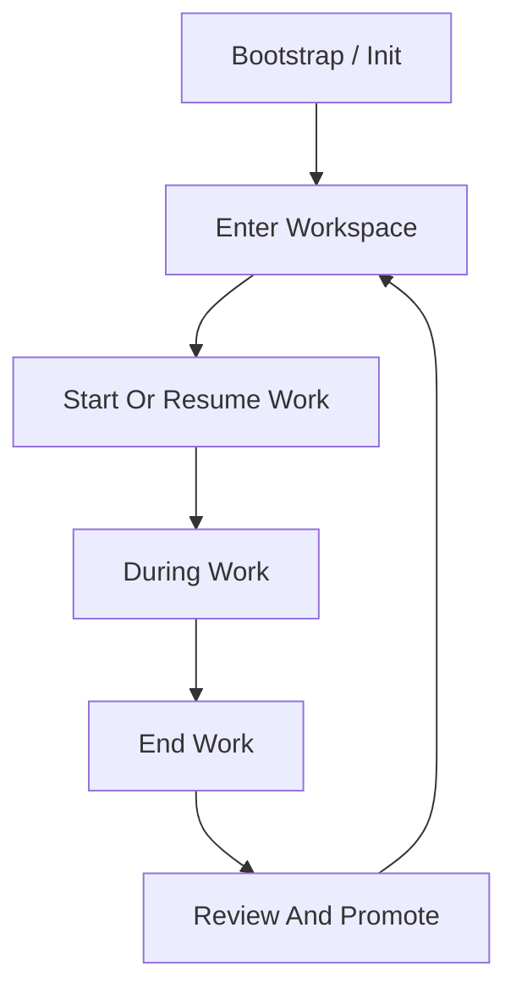
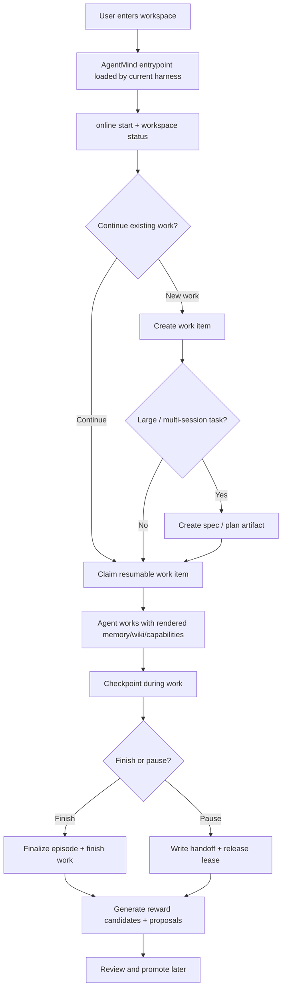
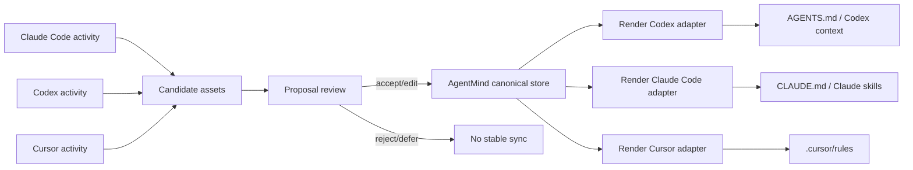
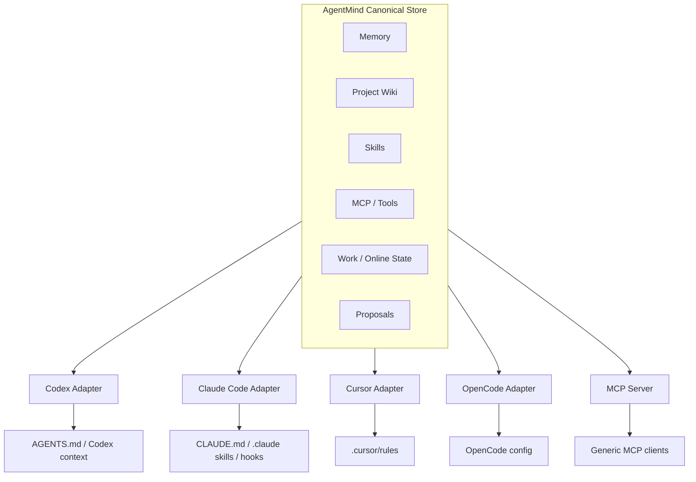
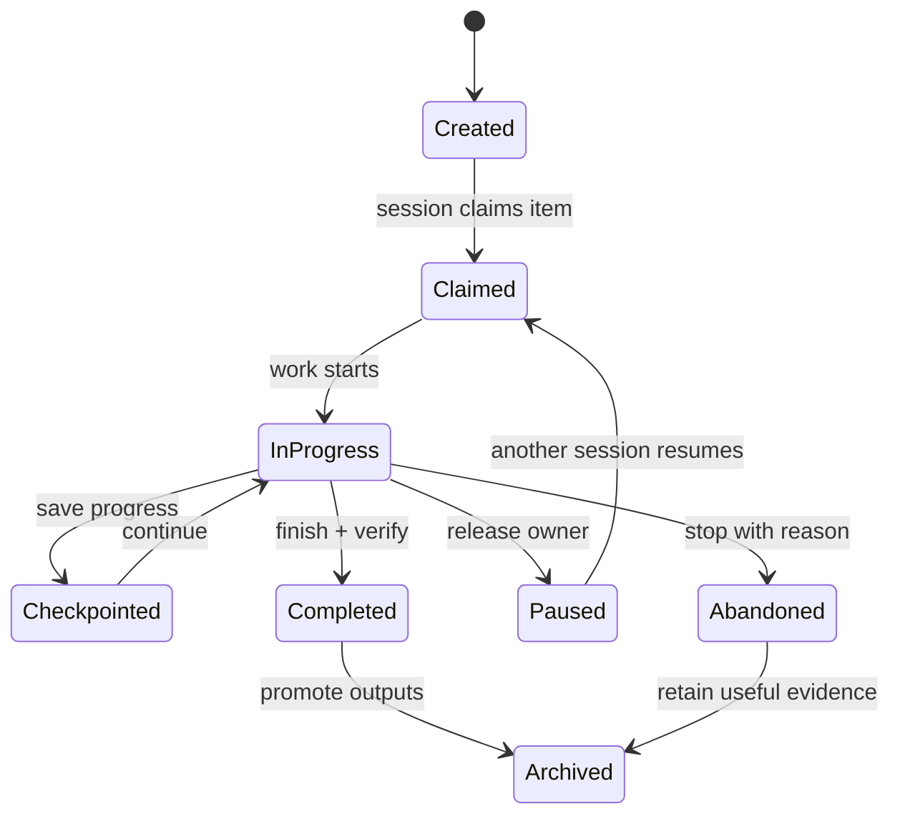
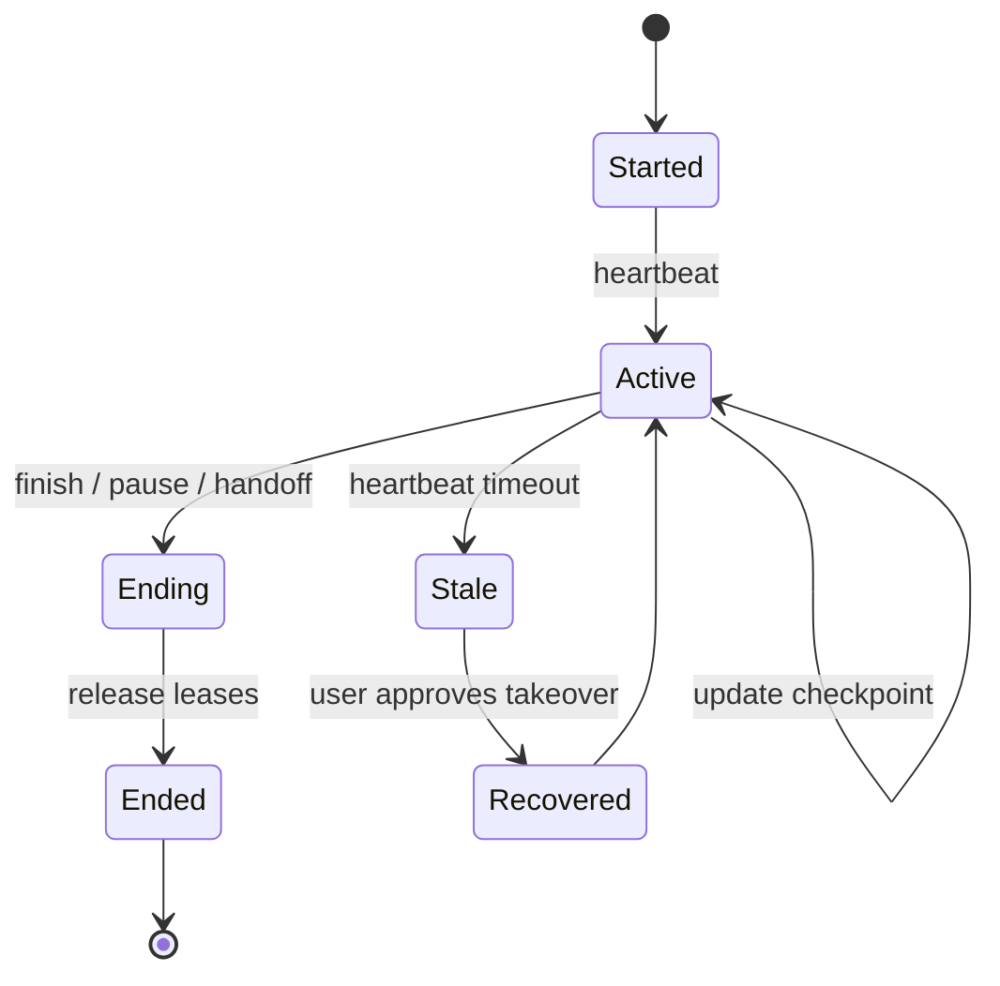

# Local Agent Context Layer 产品 PRD

## 1. 概述

Codex、Claude Code、Cursor、OpenCode 等本地 coding agent 在单次会话内已经很强，但它们的项目知识、工作偏好、skills、工具配置仍然分散在不同 agent 和不同 session 里。

本产品是一个 local-first 的 agent capability 中间层。它让一个项目 workspace 可以随着 agent 工作持续积累 memory、project wiki、可执行 skills、MCP/工具配置和 reward 信号，并把这些资产一致地适配给不同 local agent harness 使用。

本产品不是另一个 coding agent，而是 local agent 下面的项目智能层。

## 2. 产品假设

一个 local agent 在同一个项目上工作越久，应该越熟悉这个项目，越会做这个项目里的事。

这种提升不应该被锁在某一个 agent 的私有 memory 或 prompt 格式里，而应该作为 durable、inspectable、evolvable 的项目资产存在于 workspace 中，并能被 Codex、Claude Code、Cursor、OpenCode 和未来的 agent 复用。

核心产品循环是：

```text
agent 工作 -> episode 记录 -> reward 信号 -> 反思 -> 更新提案 -> 验证/审核 -> context 资产演化 -> 未来 agent 工作变好
```

## 3. 目标用户

主要用户：

- 在同一个项目中使用多个 local coding agent 的开发者。
- 长期维护代码库、反复解释项目上下文成本很高的开发者。
- 希望项目知识、规则、skills、工具能力可以持续复利的 AI-native 工程师。

次要用户：

- 希望为 repo 建立共享 agent memory 的小团队。
- 需要本地 memory/skill substrate 的 agent framework 开发者。
- 不希望依赖黑盒 SaaS memory、偏好透明本地文件的 power user。

## 4. 问题定义

当前 local agent 有四个相关问题：

1. **Session 健忘**：新会话经常缺少足够项目历史。
2. **Agent 孤岛**：Codex、Claude Code、Cursor 等 agent 使用不同的 memory、rules、skills 和配置格式。
3. **学习未结构化**：一次工作中产生的经验，很少被沉淀成长期 memory、wiki 知识或 skill。
4. **上下文过期风险**：项目事实会变化，但 agent 看到的 memory 和 instructions 往往不会同步更新。

产品目标是让项目上下文和 agent capability 在不同 harness 之间变得可累积、可迁移、可维护。

## 5. 产品目标

- 为多个 coding agent 提供共享的本地 context 层。
- 把 public memory、project wiki、skills、MCP/工具配置、reward history 作为一等资产管理。
- 把 agent 工作过程记录为结构化 episode。
- 使用人类反馈和执行结果作为 reward 信号。
- 为 memory、wiki、skills、tools 生成 staged update proposals。
- 在高风险更新写入长期资产前，支持人工审核和验证。
- 通过 Markdown 和结构化本地文件保持资产可读、可审计、可迁移。

## 6. 非目标

- 不做一个新的 coding agent。
- 不微调模型权重。
- 核心本地工作流不依赖云服务。
- 不在缺少审核或证据时自动重写重要项目知识。
- 第一版不解决完整团队级治理。

## 7. 核心概念

### 7.1 Context Assets

产品管理多种会演化的 context 资产。

| 资产 | 目的 | 例子 |
|---|---|---|
| Public Memory | 用户/workspace 偏好和工作方式 | “意图不明确时先讨论再改文件”，“优先使用 rg”，“不要轻易引入新依赖” |
| Project Knowledge System | 项目专用 wiki 内容、schema 和维护 skill | 架构、领域概念、决策、workflow、gotchas、带来源的项目事实、项目 wiki 操作规则 |
| Skills | 可执行 agent 工作流 | 新增 API endpoint、修 auth 测试、创建 migration、发布 staging |
| MCP/Tools | 工具和集成能力 | MCP servers、CLI 命令、项目脚本、工具使用规则 |
| Episodes | agent 工作历史 | 目标、使用的 context、动作、diff、命令、测试、最终回复、下一轮用户反馈 |
| Online Work State | 在线 sessions、工作 ownership、checkpoints 和 handoffs | 活跃 Codex session、stale Claude Code session、已 claim 的 work item、pause handoff |
| Rewards | 成功/失败/有用性的信号 | 用户纠正、测试通过、用户接受、工具失败、回滚 |
| Proposals | 候选资产更新 | 修改 memory、更新 wiki、修改 skill、废弃过期规则 |

### 7.2 Public Memory

Public memory 记录稳定偏好和操作约定，会影响跨 session，甚至跨项目的 agent 行为。

例子：

- 用户在产品讨论阶段偏好先讨论再实现。
- 用户偏好简洁、务实的工程沟通。
- agent 在提出架构前应先阅读现有代码模式。
- 除非用户明确批准，否则避免 destructive commands。

Public memory 影响面大，因此更新通常需要用户显式确认，或需要多次一致证据。

### 7.3 Project Knowledge System

Project knowledge system 不只是 wiki。它是 workspace 中持续演化、带业务理解的知识操作层。

这一层遵循 Karpathy 的 LLM Wiki pattern：raw sources 本身不够，因为纯检索会让 agent 在每次 query 时重新推导同一套综合理解。AgentMind 应该把稳定的项目理解编译进一个持久 wiki，让后续 agent 直接复用。因此，这个 wiki 是项目的 **compiled fixed knowledge layer**：不是永远不可变，而是稳定、source-linked，并通过显式更新维护，而不是每次查询都从零生成。

模型分为三层：

1. **Raw sources**：源代码、文档、issue、PR、transcripts、episodes、rewards、命令输出和导入 references。这些是 source-of-truth 输入，从 AgentMind 角度应只读或 append-only。
2. **Compiled wiki**：由 LLM/worker 维护的 Markdown 页面，用来总结、交叉链接、标记矛盾、更新并综合 raw sources 成项目知识。
3. **Wiki schema and maintenance skill**：约定和指令，告诉 agents 如何 ingest sources、回答 query、lint wiki、更新页面、维护链接和保留 citations。

它包含三部分：

1. **Knowledge content**：wiki 页面本身。
2. **Knowledge schema**：项目专用分类体系、页面类型、frontmatter、命名规则和 source 处理规则。
3. **Knowledge maintenance skill**：告诉 agent 如何 ingest、query、lint、update、preserve 这个 wiki 的操作说明。

半导体方案 workspace 里的 `fab-wiki` skill 是目标样本：它不是一个通用 wiki，而是在协作中演化成了业务专用操作 skill，包含 source 分类（`ours`、`competitor`、`partner`、`reference`）、领域页面类型（`clients`、`cases`、`entities`、`concepts`、`synthesis`）、战时关键页，以及项目专用 ingest/query/lint 规则。

产品应帮助每个项目逐渐长出自己的 `fab-wiki` 等价物。

Project wiki 内容应包含：

- 项目概览。
- 架构和模块边界。
- 领域模型和业务概念。
- 重要设计决策和理由。
- Workflows、runbooks、测试流程。
- Gotchas 和已知失败模式。
- 最近变化过的重要假设。

Wiki 条目应尽可能 source-linked：

```yaml
title: Auth session lifecycle
type: architecture
sources:
  files:
    - packages/api/src/auth/session.ts
  commits:
    - abc123
confidence: verified
status: active
last_updated: 2026-06-20
```

Schema 和 maintenance skill 也应从 episodes 和 reward signals 中演化。例如，如果重复工作表明一个项目需要 `clients/` 和 `cases/` 页面，而不是只有通用 `entities/`，系统应提出 schema update，并同步提出 wiki-maintenance skill 的更新。

Fixed knowledge layer 应支持四种 wiki operations：

- **Ingest**：读取 raw source 或 episode，抽取持久事实，更新相关 wiki 页面，更新 `index.md`，并追加 `log.md`。
- **Query**：优先从 compiled wiki 回答，并引用 sources；高价值答案可以 promote 回 wiki。
- **Lint**：检测 contradictions、stale claims、orphan pages、missing links、missing source citations，以及值得单独建页的 concepts。
- **Promote**：把重复答案、成功 workflow、或已审核 proposal patch 转成稳定 wiki 页面或 wiki schema update。

因此 wiki 不是被动文档目录，而是一个被维护的 knowledge codebase：raw sources 是输入，wiki pages 是 compiled artifacts，schema/maintenance skills 是 build rules。

### 7.4 Skills、MCP 和 Tools

Skills 编码可重复的项目工作流。它们应尽可能跨 agent 可移植，agent-specific 的部分只作为边缘适配层存在。

例子：

- 在这个 repo 中如何新增数据库 migration。
- 如何更新 API contract 并运行正确的测试。
- 如何 debug 登录/session 失败。
- 某类任务应该使用哪个 MCP server 或 CLI tool。

Skills 应从重复成功的 episodes、用户反馈、失败记录和验证结果中演化。

### 7.5 Episode

Episode 是工作单元，也是主要训练信号容器。

一个 episode 应记录：

- 用户目标。
- 使用的 agent。
- 被检索或注入的 context assets。
- 调用过的 skills/tools。
- 读取或修改的文件。
- 运行的命令及结果。
- 验证结果。
- 最终 assistant 回复。
- 下一轮用户消息，如果它包含对上一轮的反馈。
- Outcome label 和 reward events。

示例 schema：

```json
{
  "id": "episode_20260620_001",
  "workspace": "/path/to/project",
  "agent": "codex",
  "goal": "Add contract test for auth endpoint",
  "assets_used": [
    "wiki:api-testing-workflow",
    "skill:add-api-endpoint"
  ],
  "actions": {
    "files_read": [],
    "files_modified": [],
    "commands": []
  },
  "verification": {
    "tests": "passed",
    "lint": "not_run"
  },
  "user_feedback": null,
  "outcome": "unknown"
}
```

## 8. Reward Model

Reward 不应该和某一类资产硬绑定。一次人类反馈可能更新 skill、wiki、tool rule 或 public memory。一次执行结果也可能更新 skill、wiki workflow 或工具可靠性评分。

产品应把 reward 建模为事件，再把事件归因到相关资产。

```text
reward event -> attribution -> update proposal -> gated apply
```

### 8.1 Reward 来源

| 来源 | 描述 | 例子 |
|---|---|---|
| Human Feedback | 用户对 agent 输出或动作的反馈 | “不是，我的意思是先讨论”，“这个是对的”，“不要用这个方案” |
| Verification Result | agent 观察到的执行结果 | 测试通过、build 失败、lint 失败、app 启动成功、截图检查通过 |
| Codebase Acceptance | 工作是否被代码库接受 | commit 包含改动、PR merge、用户未回滚、后续 CI 通过 |
| Reuse Signal | Context assets 是否帮助后续任务 | 被检索、被引用、被执行，并伴随成功 outcome |
| Contradiction/Staleness | 旧知识错误或过期的证据 | 用户纠正、模块被删除、新文档替代旧流程 |
| Cost/Efficiency | 资源和流程效率 | token、turns、失败重试、命令次数、完成时间 |
| Safety/Risk | 不安全行为的负向信号 | 误改无关文件、泄露 secret、危险命令、破坏环境 |

### 8.2 Unified Reward Event

```json
{
  "id": "reward_20260620_001",
  "source": "human",
  "polarity": "negative",
  "confidence": 0.9,
  "target_episode": "episode_20260620_001",
  "evidence": [
    "User said: I wanted discussion, not implementation."
  ],
  "suspected_causes": [
    "public-memory:interaction-style missing discussion preference",
    "skill:default-coding-flow lacks intent check"
  ]
}
```

### 8.3 Reward Attribution

Attribution 决定应该改什么。

可能的归因目标：

- Public memory：用户偏好或工作方式。
- Project wiki：事实、workflow、架构、gotcha。
- Skill：步骤、前置条件、验证方式、失败处理。
- MCP/tool config：可靠性、选择规则、参数。
- Agent adapter：资产如何暴露给某个特定 agent。

Attribution 应生成 proposal，而不是直接修改稳定资产。

## 9. 演化机制

演化循环分为五个阶段。

### 9.1 Observe

记录 agent 工作形成 episode。

输入：

- 用户消息。
- Agent 回复。
- 文件读取/修改。
- Diffs。
- 命令和输出。
- 被检索的 memory/wiki/skills/tools。

### 9.2 Reflect

在新一轮用户消息开始时，检查用户是否在评价上一轮 episode。同时检查上一轮的验证结果。

输出：

- Reward events。
- Outcome label。
- 候选 attribution。

### 9.3 Propose

生成一个或多个更新提案。

Proposal 类型：

- 创建 memory。
- 更新 public memory。
- 新增/更新 wiki 条目。
- 新增/更新 wiki schema 或页面分类体系。
- 修改 project wiki maintenance skill。
- 标记 wiki 条目 stale 或 superseded。
- 修改 skill 步骤。
- 增加 skill 验证步骤。
- 更新 MCP/tool 选择规则。
- 废弃不可靠的工具用法。

示例：

```yaml
id: proposal_20260620_001
asset: skills/add-api-endpoint/SKILL.md
operation: replace
reason: User correction indicates endpoint changes require contract test updates.
evidence:
  - reward_20260620_001
  - episode_20260620_001
risk: medium
status: pending_review
```

### 9.4 Validate

验证方式取决于 proposal 类型。

例子：

- Wiki fact update：检查源文件、commit hash 或用户提供的证据。
- Skill update：重放相似任务、运行测试，或要求用户确认。
- Tool update：运行 health check，验证命令是否存在，检查失败率。
- Public memory update：除非有多次证据，否则需要显式用户确认。

### 9.5 Apply

只有通过 policy gates 后才应用更新。

建议默认策略：

| 更新 | 默认应用策略 |
|---|---|
| 临时 episode summary | 自动 |
| 低风险 handoff update | 自动 |
| 新候选 memory | 自动进入 pending/candidate 区 |
| Public memory change | 用户确认 |
| Project wiki fact change | 来源证据或用户确认 |
| Project wiki schema change | 用户确认 + migration preview |
| Project wiki maintenance skill change | 用户确认或多次 reward evidence |
| Skill behavior change | 验证或用户确认 |
| MCP/tool config change | 显式确认 |

### 9.6 Lifecycle Orchestration

AgentMind 应明确每个系统动作发生在真实项目工作的哪个阶段。否则 import、render、record、reflect、promote 和 sync 会变成临时动作，需要用户手动记住什么时候调用。

产品生命周期分为六个阶段：



同一个生命周期在产品体验上应表现为被引导的工作流，而不是要求用户手动记 CLI checklist：



| 阶段 | 触发 | AgentMind 动作 | 是否修改稳定资产 |
|---|---|---|---|
| Bootstrap / Init | `agentmind init`、adapter setup、显式 import | 创建 canonical store，扫描已有 harness 文件，导入候选 memory/skills/rules，创建 proposals，写 managed entrypoints | 只创建缺失文件和 managed blocks |
| Enter Workspace | Agent 打开项目或用户说开始 | 注册 session，读取 active sessions/work queue/stale work/pending proposals，为当前 harness 渲染 workspace status | 不修改稳定 wiki/skill |
| Start Or Resume Work | 用户选择继续旧 work 或创建新 work | 创建或 claim work item，绑定 episode，可选创建 spec，选择相关 assets，渲染 task-specific context | 只修改 work/session state |
| During Work | Agent 读写文件、运行命令、添加 reference、使用 skill | Checkpoint，记录 episode events，捕获 references，记录 skill/tool 使用和 verification，保存 observations | 默认只写候选 observations |
| End Work | 用户说 handoff/finish/stop，或任务完成 | Finalize episode，finish/pause work，释放 lease，写 handoff，生成 reward candidates 和 proposals | 写 handoff/work/episode；不做 cross-harness sync |
| Review And Promote | 用户 review proposals 或定期整理 | accept/reject/edit proposals，更新 canonical assets，渲染 adapters | 是，通过 gates 后修改 |

动作时机规则：

1. **Import** 发生在 bootstrap 或显式 import，不在工作中随机发生。
2. **Render** 发生在进入 workspace、开始/恢复 work，或 accepted promotion 之后。
3. **Record** 在工作中持续发生，并在工作结束时补全。
4. **Reflect** 发生在工作结束时，以及新一轮用户消息评价上一轮 episode 时。
5. **Promote** 只能通过 proposals 和 policy gates 发生。
6. **Cross-harness sync** 只在 canonical assets 更新后发生，然后渲染到各 harness adapter。

关键同步规则是：



AgentMind 不应把某个 harness 的私有 memory 或 skills 直接复制到另一个 harness。它应该把有价值的行为提升为 canonical cross-harness assets，再渲染成各 harness 的专用视图。

## 10. Worker Model

Worker 是一个后台执行单元，用来在主用户对话之外处理可延迟的 context evolution 任务。

Worker 不一定是 agent。它可以是确定性程序、LLM job，也可以是 subagent。

### 10.1 Worker 类型

| Worker | 职责 | 实现方式 |
|---|---|---|
| Recorder | 写入 episode records | 确定性 runtime |
| Reflector | 检测 reward 和 attribution | LLM job 或 subagent |
| Curator | 合并、去重、检查资产过期 | 确定性逻辑 + LLM 辅助 |
| Validator | 对 proposal 运行验证 | 确定性命令 + 可选 agent |
| Adapter | 导出资产到 Codex/Claude/Cursor/OpenCode | 确定性模板 |

### 10.2 Subagent 使用方式

当 reflection 需要读取大量上下文或做复杂归因时，subagent 很有用。但它不应该直接修改稳定资产。

推荐模式：

```text
main agent -> 记录 episode 并继续服务用户
reflection worker/subagent -> 异步分析 episode
worker -> 创建 pending proposals
user/policy gate -> 应用已接受 proposals
```

Subagent 是一种实现选项，不是产品原语。产品原语是 reflection job 和 proposal queue。

## 11. Agent 集成

产品应通过 adapters 把同一套 canonical assets 暴露给多个 agent。



### 11.1 Canonical Store

建议本地目录结构：

```text
.agent-context/
  sources/
    README.md
    external/
    episodes/
  memory/
    public.md
    workspace.md
  wiki/
    schema.md
    overview.md
    architecture.md
    domain.md
    workflows.md
    gotchas.md
    decisions.md
  skills/
    wiki-maintainer/
      SKILL.md
    add-api-endpoint/
      SKILL.md
    fix-auth-test/
      SKILL.md
  tools/
    mcp.json
    commands.yaml
  episodes/
    episode_20260620_001.json
  rewards/
    reward_20260620_001.json
  proposals/
    pending/
    accepted/
    rejected/
  adapters/
    codex/
    claude-code/
    cursor/
    opencode/
```

### 11.2 Adapter 输出

| Agent | Adapter Output |
|---|---|
| Codex | `AGENTS.md`、Codex skills、MCP config |
| Claude Code | `CLAUDE.md`、skills、hooks、MCP config |
| Cursor | `.cursor/rules`、MCP config |
| OpenCode | plugin/config/instructions |
| Generic MCP client | 暴露 memory/wiki/skill/tool APIs 的 MCP server |

Canonical asset 应只编辑一次。Agent-specific 文件应从 canonical asset 生成或同步。

## 12. Capability Registry & Import Layer

产品不应该只依赖自己生成 skills 和 tools。互联网上和用户本机上已经存在大量有价值的 skills、MCP servers、prompts、rules 和 CLI tools。产品应能发现、导入、评估、适配和管理这些外部能力。

Capability layer 的目标是把外部 skills/tools 转化成项目可用资产。

```text
external skills / MCP servers / tools / prompt packs
  -> capability importer
  -> candidate registry
  -> project fit and risk evaluation
  -> adapter or wrapper
  -> active project capability
  -> episode/reward based promotion, adaptation, or deprecation
```

### 12.1 Capability Sources

| 来源 | 例子 | 处理方式 |
|---|---|---|
| GitHub repositories | Skill packs、MCP servers、agent rules | 扫描 manifests、README、`SKILL.md`、config files |
| MCP registries | 官方/社区 MCP servers | 读取 tool schemas、权限、依赖 |
| Codex skills | `SKILL.md` assets | 直接导入或转换成 canonical skill format |
| Claude Code skills/plugins | `.claude/skills`、plugin assets | 转换成 canonical skill 或 adapter-specific package |
| Cursor rules | `.cursor/rules/*.mdc` | 转换成 rules、memory candidates 或 workflow skills |
| Prompt packs | `AGENTS.md`、`CLAUDE.md`、rules files | 拆分成 rules、workflows 和 skill candidates |
| CLI tools | npm/pip/cargo/brew packages、repo scripts | 注册为带 command metadata 的 tool capabilities |
| 本机配置 | 现有 MCP config、本地 skills、shell scripts | 发现并索引成本地 capability candidates |

### 12.2 Capability Metadata

每个导入能力在激活前都应有元数据记录。

```yaml
id: mcp.github
type: mcp_server
source:
  kind: github
  url: https://github.com/modelcontextprotocol/servers/tree/main/src/github
version: 1.2.0
description: GitHub repository, issue, and PR operations.
permissions:
  network: true
  filesystem: false
  secrets:
    - GITHUB_TOKEN
risk: medium
status: candidate
project_fit:
  score: 0.72
  reasons:
    - Project uses GitHub issues and pull requests.
    - Recent episodes needed PR context.
adapters:
  codex: available
  claude-code: available
```

### 12.3 Capability 生命周期

Capabilities 应经过显式生命周期：

```text
discovered -> candidate -> installed -> project-adapted -> active -> promoted -> deprecated
```

- `discovered`：已发现，但尚未分析。
- `candidate`：可能有用，等待评估或用户审核。
- `installed`：已下载或配置，但不一定启用。
- `project-adapted`：已结合本 repo 的命令、wiki、约定和历史 episodes 做本地化。
- `active`：当前 workspace 中 agent 可用。
- `promoted`：多次有效，默认推荐。
- `deprecated`：失败、过期、风险过高或不再相关。

### 12.4 Project Fit Evaluation

系统应基于多种信号推荐外部能力：

- 静态 repo 匹配：语言、框架、package manager、config files、infra files。
- Episode demand：近期反复出现 PR review、browser testing、database schema lookup、Terraform、release notes 等任务。
- 用户行为：用户反复手动请求某类工作，且能映射到已有 skill 或 MCP server。
- Outcome data：能力成功率、失败率、用户接受度、节省时间。
- Risk data：secrets、network access、filesystem access、destructive actions、deployment 或 billing access。

### 12.5 Project Adaptation

外部能力通常是通用的。产品应先把它们 grounding 到当前项目，再晋升为推荐能力。

例如，一个通用 `fix-failing-tests` skill 可以适配成包含以下内容的项目 skill：

- 本 repo 的测试命令。
- 应优先测试哪个 package。
- 已知 flaky tests。
- Snapshot update policy。
- CI/local 差异。
- 用户关于验证流程的偏好。

这属于 external skill grounding，不是从零生成 skill。

### 12.6 Safety Model

外部 tools 和 MCP servers 风险更高。产品不应静默激活高风险能力。

| 风险 | 例子 | 默认策略 |
|---|---|---|
| Low | 纯 instruction Markdown skill | 自动导入为 candidate |
| Medium | 本地 CLI、只读 MCP server | 需要用户确认后启用 |
| High | 网络、写权限、secrets、GitHub mutation | 显式 permission review |
| Critical | Shell execution、删除、部署、支付 | 强确认，永不自动启用 |

安全要求：

- 激活前展示 permission summary。
- 固定 source 和 version。
- 支持 allowlist/blocklist。
- 记录 tool calls 和 failures。
- Secrets 不写入生成的 skills/wiki。
- 支持停用和回滚。

### 12.7 Capability Discovery Workflow

示例用户流程：

```text
memory-helper discover capabilities
```

产品返回 ranked candidates：

```text
1. GitHub MCP
   Why: repo uses GitHub; recent episodes mention PR review.
   Risk: medium; requires GITHUB_TOKEN.
   Action: install / ignore / later

2. Playwright MCP
   Why: project has playwright.config.ts.
   Risk: medium; browser automation.
   Action: install / ignore / later

3. fix-failing-tests skill
   Why: repeated test failures in episodes.
   Risk: low; instruction-only.
   Action: import / adapt / ignore
```

导入后的 capability 仍进入 episode/reward/proposal 循环。成功使用可以促成 promotion 或 project adaptation；反复失败可以触发 patch、disable 或 deprecate。

## 13. Project Work Queue

AgentMind 应把项目执行状态作为一等 context asset 管理。这不是普通 TODO list，而是一个结构化 work queue，用来连接开放问题、当前工作、已完成工作、episodes、rewards、proposals、wiki pages、references 和 skills。

Work queue 回答：

- 什么还没解决？
- 当前正在做什么？
- 什么已经完成？
- 每个事项关联了哪些 episodes 和 rewards？
- 哪些已完成事项应该 promote 进 fixed knowledge 或 skills？

### 13.1 Work States

| 状态 | 目的 | 例子 |
|---|---|---|
| TODO / Backlog | 未来工作、开放问题、待验证假设、待 ingest reference | 定义 fixed knowledge promotion policy；决定 wiki lint 分工 |
| Doing | 当前活跃任务、current episode、阻塞点、待审核 proposals | 实现 Codex adapter；审核 imported skill adaptation |
| Done | 已完成任务及其 outcomes | 初始化 project store；接受 wiki schema update |

### 13.2 建议存储

```text
.agent-context/work/
  index.md
  todo.md
  doing.md
  done.md
  items.jsonl
```

Markdown 文件便于人类和 agent 快速阅读。`items.jsonl` 为 runtime 提供结构化事件流。

示例 item：

```yaml
id: task_20260622_001
status: todo
title: Define fixed knowledge promotion policy
type: product-question
source: user
priority: high
links:
  episodes: []
  rewards: []
  proposals: []
  wiki:
    - wiki/schema.md
  references:
    - ref_karpathy_llm_wiki
created_at: 2026-06-22T00:00:00Z
```

### 13.3 初始 Work Queue Items

以下开放产品问题应作为 TODO items 记录，而不是只留在聊天历史中：

- 定义什么样的 source-derived note 或 episode insight 有资格 promote 成 fixed project knowledge。
- 决定哪些 wiki lint checks 应该 deterministic，哪些应该 LLM-assisted。

### 13.4 与 Episodes 和 Fixed Knowledge 的关系

每个重要 episode 都应可选关联到一个 work item。当 work item 进入 Done，系统应询问是否把产出 promote 到：

- Project wiki fixed knowledge。
- Wiki schema。
- Wiki maintenance skill。
- Project skill/tool capability。
- Public 或 workspace memory。

这样项目推进状态本身也会进入 self-evolution loop。

## 14. Online Work Management

AgentMind 应把在线项目工作作为一级模块管理。这个模块负责当前工作现场：哪些 local agent harness 正在这个 workspace 中，分别 owner 哪些工作，哪些 session 已经 stale，哪些任务可以恢复，以及工作如何创建、暂停、完成、放弃和交接。

它是 Project Work Queue 的在线层。Work queue 记录 durable task state；Online Work Management 记录围绕这些任务的 live session layer。

### 14.1 目标

Online Work Management 应回答：

- 当前 workspace 中有哪些 agent/product harness sessions 在线？
- 每个 session owner 哪个 work item？
- 每个 active work item 的最新 checkpoint 是什么？
- 哪些 sessions 或 leases 已经 stale，可以恢复？
- 下一个 agent 继续前应该读什么？
- 工作结束时应该产出什么：episode、reward signals、proposals、handoff，还是 wiki updates？

### 14.2 核心对象

| 对象 | 目的 | 说明 |
|---|---|---|
| WorkSession | workspace 中一个活跃的 local agent/product session | 包含 harness type、session id、start time、heartbeat、focus、owned items |
| WorkItem | 一个持久任务或开放问题 | 存在于 Project Work Queue 中，可跨多个 sessions |
| WorkLease | 对某个 work item 的临时 ownership claim | 防止两个 harness 静默编辑同一任务范围 |
| Checkpoint | 某个 work item 最新可恢复状态 | 包含 summary、next step、blockers、changed files、verification |
| Handoff | session 结束或任务转交时的接力产物 | 让下一个 harness 不依赖聊天历史也能继续 |

### 14.3 工作生命周期



Session 生命周期独立但相互关联：



### 14.4 创建和开始工作

当 agent 进入 workspace 时，AgentMind 应创建或刷新一个 `WorkSession`，并返回项目现场摘要：

```text
agentmind online start --harness codex --session codex-20260622-a
```

预期输出：

- Active sessions 和 stale sessions。
- 当前 `Doing` work items。
- 可 claim 的 unowned work items。
- 最新 checkpoints 和 handoffs。
- 相关 memory、wiki pages、references 和 capabilities。

开始某个具体 work item 时，应 claim 一个 lease：

```text
agentmind work claim <work-id> --session codex-20260622-a
```

Lease 应包含有边界的 ownership scope，例如目标文件、wiki sections 或 capability records。

### 14.5 工作中

Active session 工作过程中，agent 应周期性更新：

- Heartbeat timestamp。
- Current focus。
- Latest checkpoint。
- Changed files 或 touched assets。
- Blockers 和 assumptions。
- 可供 reflection 使用的候选 observations。

MVP 可以把这些更新做成显式 CLI calls。后续版本可以集成到 adapters 或 hooks 中。

### 14.6 结束、暂停、放弃或转交工作

工作结束应该是显式操作，而不是只靠聊天约定。

```text
agentmind work finish <work-id>
agentmind work pause <work-id>
agentmind work abandon <work-id> --reason "..."
agentmind online end --session codex-20260622-a
```

End-of-work 输出应包含：

- Final episode summary。
- Verification results。
- Work item state transition。
- Handoff note。
- Released lease。
- Candidate reward events。
- 对 memory、wiki、schema、skill 或 capability updates 的 proposals。

Paused work 保留 active work item，但释放 owner。Abandoned work 记录原因并保留有价值 evidence，不应静默删除 context。

### 14.7 Stale Session Recovery

AgentMind 不应把 session liveness 当成绝对事实。Session 可能因为 terminal 关闭、进程崩溃，或某个 agent product 丢失状态而消失。

推荐策略：

- Heartbeat 超过可配置阈值后，session 进入 `stale`。
- Stale leases 进入 `recoverable`，但不自动重新分配。
- 新 agent 可以报告 stale work，并询问用户是否 take over、pause 或 abandon。
- Recovery 应创建 handoff event，方便后续分析 ownership change。

这吸收了 `具身智能` workspace 中有效的模式：`JOURNAL.md` 追踪 active work，`.claude/sessions/` 追踪在线 sessions，handoff rules 保留连续性。AgentMind 应把这套机制结构化，并扩展到 cross-harness。

### 14.8 建议存储

```text
.agent-context/online/
  sessions.jsonl
  leases.jsonl
  heartbeats/
    codex-20260622-a.json

.agent-context/work/
  items.jsonl
  events.jsonl
  handoffs/
    work_20260622_001.md
```

`jsonl` 文件作为 runtime 的事实源。Markdown handoffs 方便人类和 local agents 快速阅读。

## 15. Reference Intake

用户在产品思考、设计、研究或实现过程中经常会提供外部 reference，例如 gists、papers、GitHub repos、blog posts、docs、issue threads 和 sample projects。这些 reference 可能是重要证据和设计输入，AgentMind 不应该让它们只停留在聊天历史里。

Reference Intake 把外部 reference 捕获为 raw sources，关联到 work items，并可选触发 wiki/schema/skill update proposals。

### 15.1 Reference 生命周期

```text
captured -> summarized -> linked -> ingested -> cited -> superseded/archived
```

- `captured`：记录 URL/file/repo metadata。
- `summarized`：总结关键 claim 和相关性。
- `linked`：连接到 work items、wiki pages、proposals 或 skills。
- `ingested`：把持久洞察提议进入 compiled wiki。
- `cited`：wiki 或 skill entries 引用该 reference。
- `superseded/archived`：被新的 reference 替代或降低相关性。

### 15.2 建议存储

```text
.agent-context/sources/
  external/
    karpathy-llm-wiki/
      source.md
      metadata.json
      notes.md
```

示例 metadata：

```json
{
  "id": "ref_karpathy_llm_wiki",
  "type": "external_reference",
  "url": "https://gist.github.com/karpathy/442a6bf555914893e9891c11519de94f",
  "title": "LLM Wiki",
  "source_class": "reference",
  "added_by": "user",
  "importance": "high",
  "related_questions": [
    "fixed knowledge promotion policy",
    "wiki maintenance schema"
  ],
  "status": "captured",
  "created_at": "2026-06-22T00:00:00Z"
}
```

### 15.3 Reference 和 Capability 的区别

References 和 capabilities 是不同资产类型：

- **Reference** 是证据、设计输入、外部知识或 source material。
- **Capability** 是 agent 可使用的 executable skill/tool/MCP/rule。

Karpathy 的 LLM Wiki gist 是 high-importance design reference。它应被捕获到 `sources/external`，关联到 fixed knowledge 相关 work items，并被 wiki/schema proposals 引用。它不应被当作 executable capability。

### 15.4 Reference Intake Workflow

预期 workflow：

```text
reference add <url-or-path>
  -> capture metadata and source snapshot/excerpt
  -> classify source class and importance
  -> link to current work item or open question
  -> propose wiki/schema/skill updates when useful
```

这样重要外部资料会成为项目 source graph 的一部分，并能用 citations 支撑 fixed knowledge。

## 16. 关键用户流程

### 16.1 初始化 Workspace

用户在项目目录中运行 setup。

预期结果：

- 创建 `.agent-context/`。
- 生成或 bootstrap 初始 project wiki。
- 索引已有 repo docs。
- 配置 agent adapters。

### 16.2 使用任意 Local Agent 工作

当支持的 agent 在 workspace 中启动时：

- 它能拿到相关 public memory。
- 它能看到 project wiki 和当前 handoff。
- 它能发现可用 skills 和 tools。
- 它能通过 MCP 或生成文件查询 context layer。

### 16.3 结束或继续工作

任务/session 结束时：

- Episode 被 finalized。
- Verification results 被附加。
- Handoff 被更新。
- Candidate memory/wiki/skill updates 被创建。

下一轮用户消息开始时：

- 用户对上一轮的反馈被解释为 reward。
- Reflection worker 生成 update proposals。

### 16.4 审核演化提案

用户可以审核 pending updates：

```text
review updates
```

产品展示：

- Proposed change。
- Target asset。
- Evidence。
- Risk level。
- Validation result。

用户可以接受、拒绝、编辑或延后。

### 16.5 发现和导入外部能力

用户可以让产品为当前项目发现相关外部 skills、MCP servers 和 tools。

预期结果：

- 系统扫描项目结构、近期 episodes 和已配置能力源。
- 返回带 fit reasons 和 risk summaries 的 ranked capability candidates。
- 用户可以 import、adapt、ignore 或 defer 每个能力。
- 导入能力在满足风险策略前保持 inactive。

### 16.6 维护 Fixed Knowledge

用户或 agent 可以显式维护 compiled wiki layer。

预期 workflows：

- `wiki ingest <source>`：把 raw source、episode 或 reference ingest 成 wiki proposals。
- `wiki query <question>`：优先从 `index.md` 和相关 compiled wiki pages 回答，再 fallback 到 raw sources。
- `wiki lint`：检查 contradictions、stale claims、orphan pages、missing citations 和 schema drift。
- `wiki promote <episode-id>`：把有价值答案或成功 episode 转成 durable fixed knowledge。

MVP 可以把这些实现为 proposal-generating commands，而不是完全自动重写 wiki。

### 16.7 管理在线工作

用户或 agent 可以显式管理 active sessions 和 work ownership。

预期 workflows：

- `online start --harness <name> --session <id>`：注册 live session，并返回 workspace status。
- `online status`：展示 active sessions、stale sessions、active leases 和可恢复 work。
- `work claim <id>`：为当前 session claim 一个 work item。
- `work checkpoint <id>`：保存 progress、blockers、next step 和 verification state。
- `work pause <id>`：释放 ownership，但保留 item 可恢复。
- `work finish <id>`：完成 item，并触发 episode/proposal generation。
- `online end --session <id>`：释放 leases、写 handoff、关闭 session。

### 16.8 追踪工作和捕获 References

用户或 agent 可以记录项目 work items 和 external references。

预期 workflows：

- `work add <title>`：新增 TODO/backlog item。
- `work start <id>`：移动 item 到 Doing，并可选关联 current episode。
- `work done <id>`：标记完成，并在合适时提出 promote 到 wiki/skills/memory 的 proposal。
- `reference add <url-or-path>`：捕获 external reference，并关联到 task、wiki page 或 proposal。

## 17. MVP 范围

MVP 应验证 compounding loop，而不是一开始过度建设。

### 17.1 包含

- 本地 file-backed workspace store。
- Raw sources 目录，用于存放 source-of-truth inputs。
- External reference intake metadata and storage。
- 带 TODO/Doing/Done 状态的 project work queue。
- 管理 sessions、leases、checkpoints、handoffs 和 stale recovery metadata 的 online work management。
- Public memory 文件。
- 作为 compiled fixed knowledge layer 的 Project wiki Markdown 文件。
- Project-specific wiki schema 文件。
- 带 ingest/query/lint 行为的 project wiki maintenance skill。
- 使用 `SKILL.md` 格式的 skill directory。
- Episode recording。
- 从用户反馈和验证结果中记录 reward event。
- 对 latest episode 的 reflection command。
- Pending proposal queue。
- 手动 review/apply flow。
- 基础 Codex 和 Claude Code adapters。
- 基础 MCP server 或 CLI query interface。
- Capability registry metadata 文件。
- 从本地路径或 GitHub URL 手动导入 instruction-only skills。
- 基础 capability risk classification。
- 针对导入 skills 的基础 project adaptation proposal。
- 基础 wiki lint/promote proposal generation。
- Work queue 和 reference capture 的基础命令或数据模型。
- Online status/start/end 和 work claim/checkpoint/pause/finish 的基础命令或数据模型。

### 17.2 暂缓

- 完整 team/org sharing。
- Cloud sync。
- 复杂 vector search。
- 自动 skill replay benchmarks。
- 默认常驻 daemon。
- 复杂 GUI。
- 自动直接修改稳定资产。
- 自动安装高风险 MCP servers/tools。
- 完整 marketplace 或 hosted capability registry。
- 自动全网爬取 skills/tools。
- 完整 task-management UI。
- 完整 external reference crawler/summarizer。

### 17.3 MVP 缺口收口计划

当前 MVP 只有在真实 workspace 中形成自然引导式工作流，而不要求用户手动记 CLI 命令时，才算真正可用。更大范围 dogfooding 前必须补齐以下缺口。

#### 17.3.1 Claude Code Workflow Skill And Hook

问题：`connect claude` 不能只依赖 `CLAUDE.md` managed block。Claude Code 应获得项目级 workflow skill 和轻量 SessionEnd 兜底，类似 `具身智能` workspace 中已经验证过的模式。

实现方案：

- `agentmind connect claude` 生成 `.claude/skills/agentmind-workflow/SKILL.md`。
- Skill 触发词包括 `start`、`continue`、`开始`、`继续`、`new work`、`spec`、`收工`、`handoff`、`结束`、`pause`。
- Skill 指导 Claude Code 执行 `agentmind online start/status`，汇报 active/resumable work，创建或 claim work，大任务创建 spec，工作中 checkpoint，收工时 finish/pause/end。
- `agentmind connect claude` 生成 `.claude/hooks/agentmind-session-end.sh`，并在 `.claude/settings.json` 注册。
- Hook 只做兜底：可以写 heartbeat/end marker，并提醒未来 session 做 stale recovery，但不能自动把 work 标记为 done，也不能自动 promote 资产。

验收标准：

- 新 Claude Code session 进入 connected workspace 后，可以通过 skill 被自然引导，不需要用户手动回忆 AgentMind 命令。
- 已有 `CLAUDE.md`、`.claude/skills`、`.claude/settings.json` 内容不会在 AgentMind managed block 或生成文件之外被覆盖。
- 重复运行 `connect claude` 是幂等的。

#### 17.3.2 Work Close To Episode And Proposal Candidates

问题：`work finish` 和 `work pause` 目前只更新 work state 和 handoff，还没有进入 self-evolution loop。

实现方案：

- `work finish` 创建或更新一个关联到 work item 的 episode record。
- `work pause` 创建 partial episode 或 handoff observation，并关联到 work item。
- Close events 收集 summary、next step、changed files、checkpoints、verification 和 referenced capabilities。
- 当有证据时，runtime 创建低风险 pending proposals，用于候选 memory/wiki/skill updates。
- 不直接修改稳定资产；proposals 进入 pending，等待 review。

验收标准：

- 完成的 work item 会在 `episodes/` 中出现对应记录，并链接回 work id 和 latest checkpoint。
- `review` 能展示从 completed work 生成的 proposals。
- Done work items 可以追溯到 outcomes 和 candidate promotions。

#### 17.3.3 Stale Session Detection And Recovery

问题：`online status` 已能记录 sessions 和 leases，但还不能识别 stale sessions，也不能引导恢复。

实现方案：

- `online status` 根据 heartbeat age 和可配置 threshold 计算 stale sessions。
- Stale session 持有的 active leases 被报告为 `recoverable`，但不自动重新分配。
- 下一个 agent 看到推荐动作：take over、pause 或 abandon。
- Recovery 创建 work event 和 handoff record，保证可审计。

验收标准：

- `online status` 能展示 stale session、age 和 owned work。
- Recoverable lease 可以通过用户批准的动作显式 release 或 transfer。
- 不会从非 stale active session 中静默抢走 work item。

## 18. 竞品/参考项目

相关项目和启发：

| 项目 | 启发 |
|---|---|
| Project Butler | Project wiki 和 handoff 可以产品化为 plain Markdown workflow。 |
| Semiconductor `fab-wiki` workspace | Project wiki 应演化成业务专用 maintenance skill，而不是停留在通用 wiki。 |
| agmem | Project memory 应 source-linked，并带 hashes/commits 来对抗过期。 |
| OKF | Markdown + YAML frontmatter bundle 是好的交换格式，但不提供项目专用 agent operating skill。 |
| ClawMem | Memory 需要 lifecycle、contradiction detection、recall tracking、本地 hooks/MCP。 |
| omem | Memory 受益于 scoped sharing、provenance、reconciliation、promotion/decay。 |
| Engram | Agent-agnostic local memory 可以以 SQLite/FTS/MCP/CLI 的 single binary 形态成立。 |
| ECC | Skills/rules/hooks/MCP 应有 canonical sources，并用薄 agent adapters 适配。 |
| SkillOpt | Skill evolution 需要 bounded edits、staged proposals 和 validation gates。 |

产品机会是把这些思路整合为一个 coherent、local-first、面向 coding agent 的 project intelligence layer。

## 19. 成功指标

早期产品指标：

- 跨 session 重复解释项目的次数减少。
- 每周 accepted proposals 数量。
- Proposal acceptance rate。
- 从 episodes 中产生的有用 wiki entries 数量。
- 从重复工作中改进的 skills 数量。
- Context assets 在成功 episodes 中被复用的频率。
- 用户对重复错误的纠正减少。
- Cross-agent reuse：同一个 workspace context 被多个 agent 成功使用。
- 被导入并晋升的有用外部 capabilities 数量。
- 跨项目重复手动配置工具的次数减少。
- 被捕获并引用的重要 external references 数量。
- Done work items 中关联 episodes 和 outcomes 的比例。

质量指标：

- False positive memory updates。
- 被检测出的 stale wiki entries。
- Skill update rollback rate。
- Tool failure rate before/after proposal application。
- 重复任务类型的平均 turns 或 command attempts。
- Capability 因失败或风险被 deprecate 的比例。
- Done items 被 promote 到 wiki、schema、skills 或 memory 的数量。

## 20. 开放问题

- Reflection 应该在每轮开始时同步进行多少，多少应在 episode 后异步进行？
- Auto-staging 和显式用户 review 的阈值应该如何设定？
- 第一版应以 MCP、生成文件，还是二者并行为主要 agent 集成方式？
- Source-linked wiki entries 应如何表示，才能同时人类可读和机器可检查？
- 什么样的 source-derived note 或 episode insight 才有资格 promote 成 fixed project knowledge？
- 哪些 wiki lint checks 应该是 deterministic，哪些应该由 LLM 辅助？
- Skill update 生效前最低需要什么验证？
- 系统应如何防止错误理解人类反馈，从而污染长期 memory？
- 跨项目 public memory 应是全局、workspace-scoped，还是由用户为每个 workspace 控制？
- 第一批应支持哪些外部 capability sources：本地路径、GitHub URL、MCP registries，还是 agent-specific marketplaces？
- 导入 MCP servers 和 CLI tools 需要怎样的 permission model 才足够？
- 导入 skill 在用户 review 前应自动做多少 project adaptation？
- Work queue 状态机应该多严格：free-form Markdown、structured JSONL，还是两者并行？
- 在 single-user local-first MVP 中，leases 和 heartbeat recovery 应该多严格？
- 哪些 external references 应该本地 snapshot，哪些只保存 metadata 和 citations？
- 除 `reference` 外，还需要哪些 source classes，例如 `ours`、`competitor`、`partner`、`paper`、`repo`、`standard`？

## 21. 产品定位

暂定名：**AgentMind**。

定位：

> AgentMind 是一个 local-first、自我进化、面向 cross-harness coding agents 的 capability layer。它把 agent 工作记录为 episodes，从人类反馈和执行结果中学习，通过可审核 proposals 持续演化项目专用 memory、wiki 内容、wiki schema、maintenance skills 和 tools，并把这些 context 资产适配给 Codex、Claude Code、Cursor、OpenCode 和其他 local agent harnesses。
